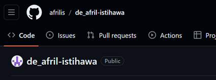
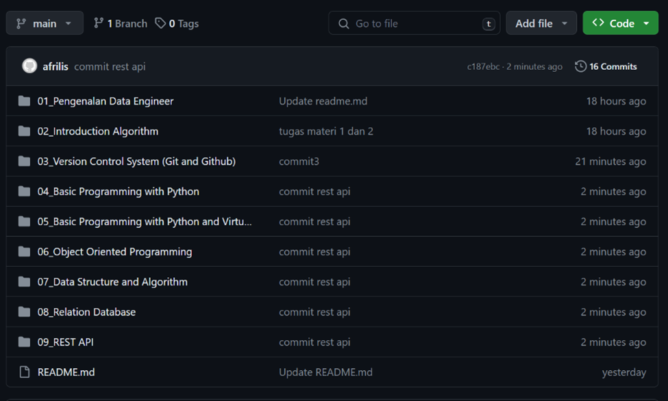
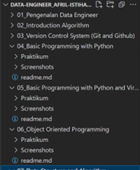
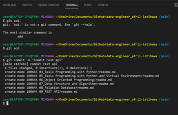
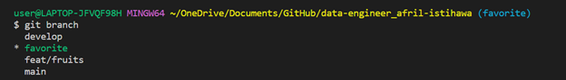
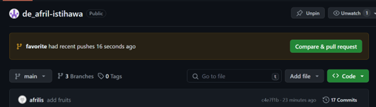
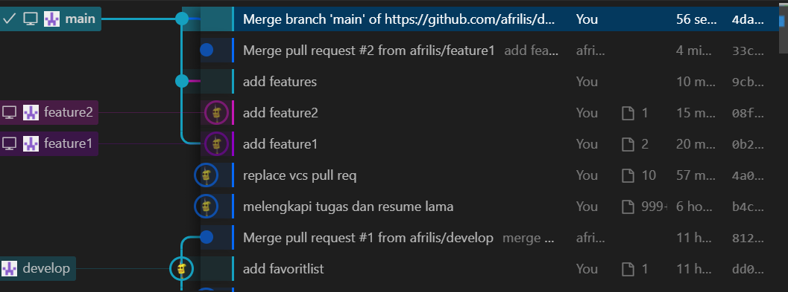
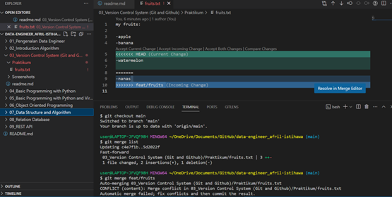

# LATIHAN

## Prioritas 1 

1. Buatlah sebuah repository Github yang sesuai dengan  format namaKelas_namaKalian. Contohnya adalah sebagai berikut:

2. Buatlah folder yang berurutan dan diberi nama sesuai dengan nama soal yang kalian kerjakan. contoh penamaan
- 1_Soal_GIthub
- 2_Soal_Intro_Algorithm
- 3_Soal_Basic_Programming

seterusnya sesuai dengan nama soal yang kalian kerjakan. buat folder tersebut sampai soal rest API.
Contoh dapat dilihat pada gambar berikut:

Pada setiap folder berisi sub folder seperti berikut:

               

Lakukan commit.

## Prioritas 2 

1. Buatlah branch baru pada Github yang telah kalian buat.

2. Lakukan Pull Request pada branch tersebut sehingga akan menambah hal baru pada branch main/master
terdapat foto terkait Pull Request.

## Eksplorasi 

1. Pilih project terserah kalian, praktekkan salah satu workflow serderhana dan buktikan dengan Screenshoot. Contoh workflow yang dapat digunakan adalah github flow/gitflow/trunk base.
Terdapat foto terkait flow yang disebutkan.

2. Lakukan management konflik pada Github.

3. Lakukan code review pada Github yang kalian kumpulkan.
Terdapat foto seperti apa itu code review.