# LATIHAN RELATION DATABASE

## Merancang Skema Database

1. Buatlah rancangan skema database dengan kriteria sebagai berikut:
- a. Sistem dapat menyimpan data mengenai detail item product, yaitu : product, product_type,             product_description, operator, payment_methods.
- b. Sistem juga harus menyimpan data mengenai pelanggan yang akan membeli product tsb diantaranya : nama, alamat, tanggal lahir, status_user, gender, created_at, updated_at.
- c. Sistem dapat mencatat transaksi pembelian dari pelanggan.
- d. Sistem dapat mencatat detail transaksi pembelian dari pelanggan.
Gunakan draw.io atau lucidchart untuk membuat ERD.

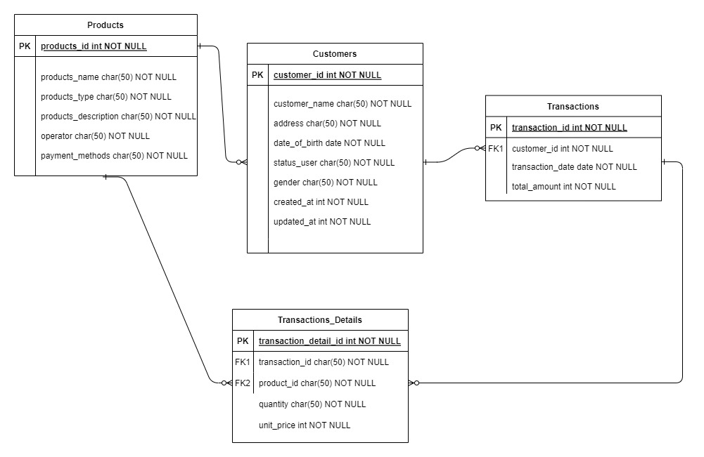

## Data Definition Language (DDL)

1. Create database alta_online_shop.

2. Dari schema Olshop yang telah kamu kerjakan di, Implementasikanlah menjadi table pada MySQL.
Create table user.

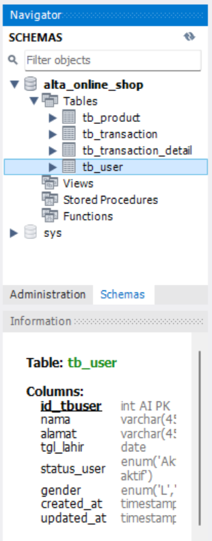

Create table product, product type, operators, product description, payment_method.

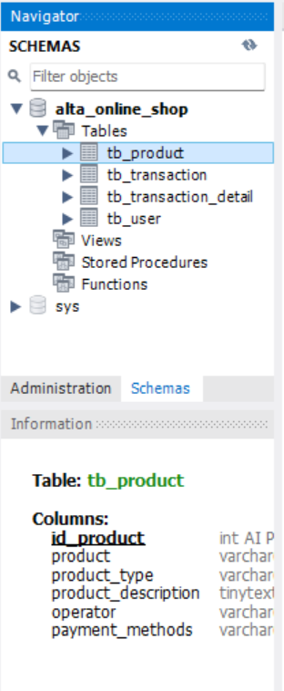

Create table transaction, transaction detail.

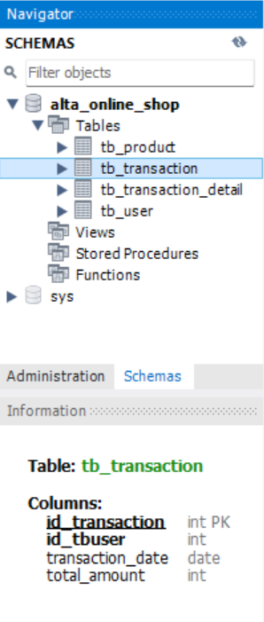

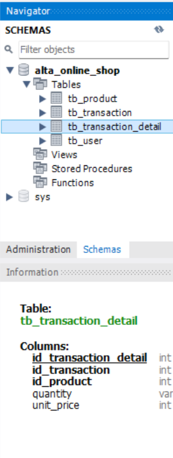

3. Create tabel kurir dengan field id, name, created_at, updated_at.

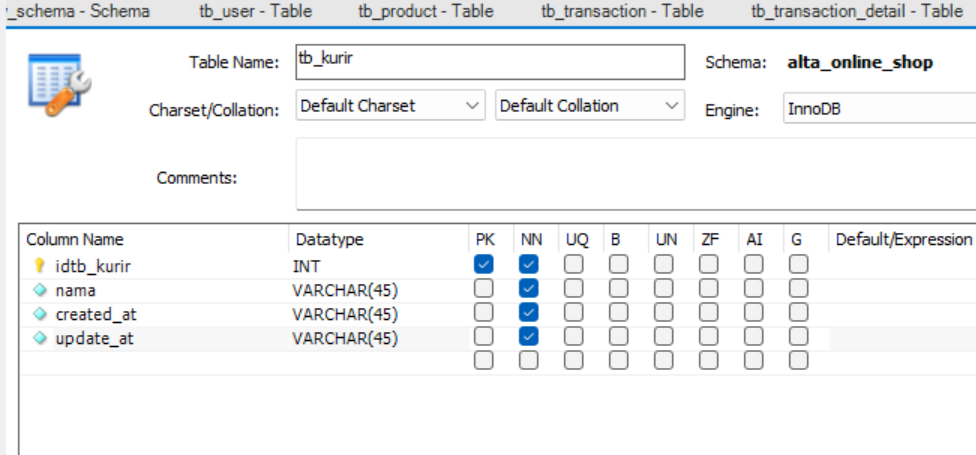

4. Tambahkan ongkos_dasar column di tabel kurir.

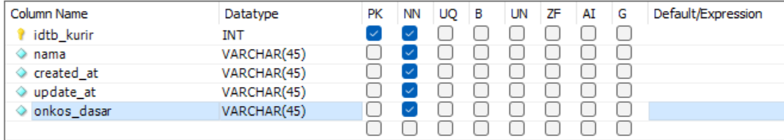

5. Rename tabel kurir menjadi shipping.

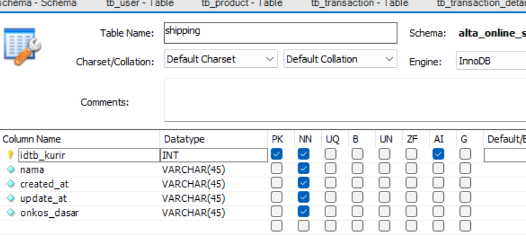

6. Hapus / Drop tabel shipping karena ternyata tidak dibutuhkan.

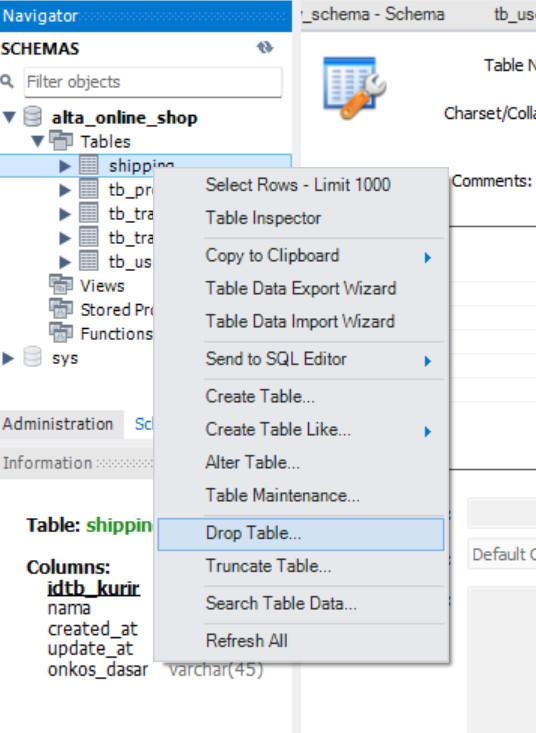

7. Silahkan menambahkan entity baru dengan relation 1-to-1, 1-to-many, many-to-many. Seperti:
1-to-1: payment method description.

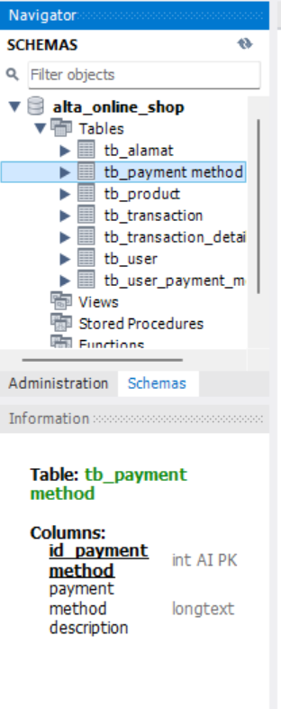

1-to-many: user dengan alamat.

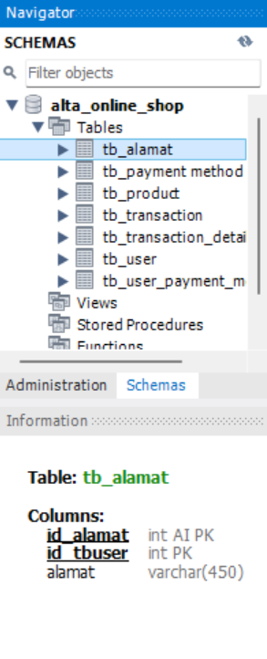

many-to-many: user dengan payment method menjadi user_payment_method_detail.

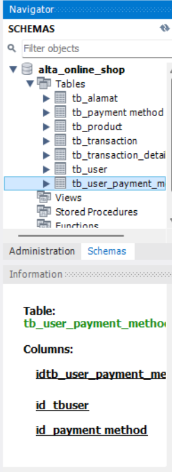