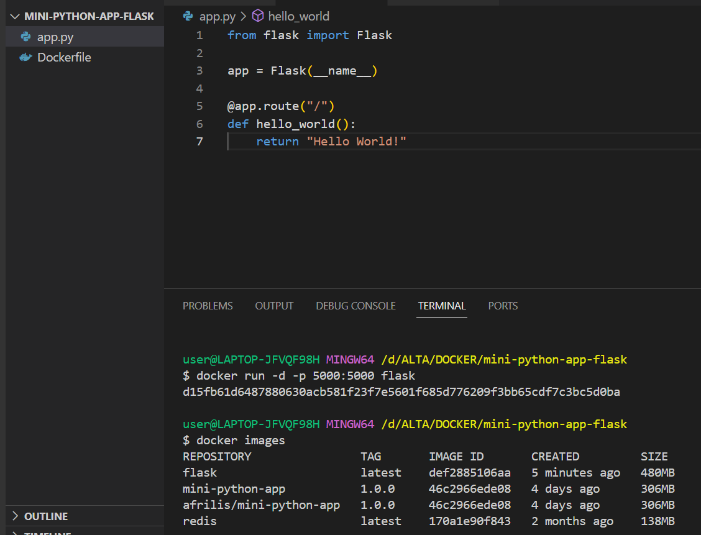

# PRIORITAS 1

1. Lakukan containerization pada aplikasi Python dengan kriteria berikut:
- Jenis aplikasi yang dipilih bebas asalkan dikembangkan dengan Python.
- Menggunakan Docker sebagai containerization.

Aplikasi : python flask
containerization pada aplikasi

2. 