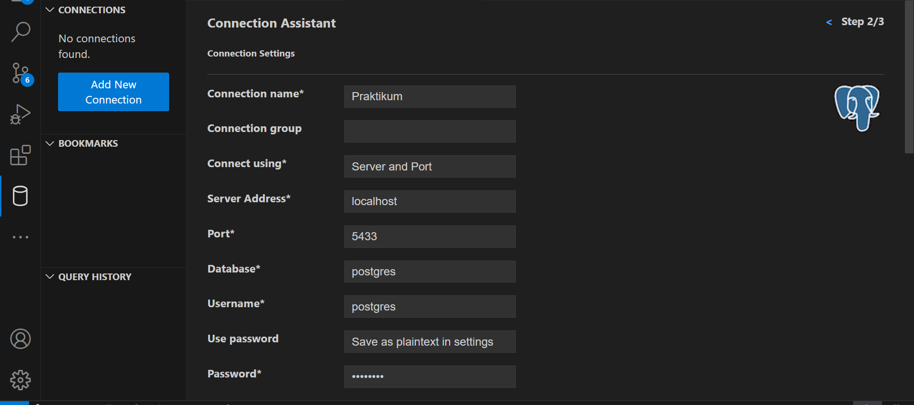
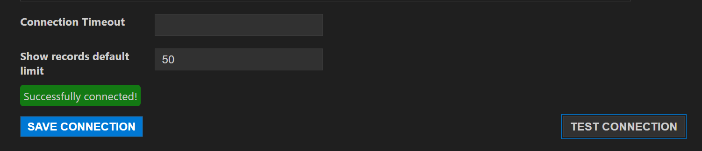
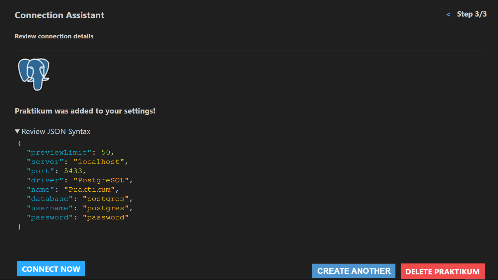
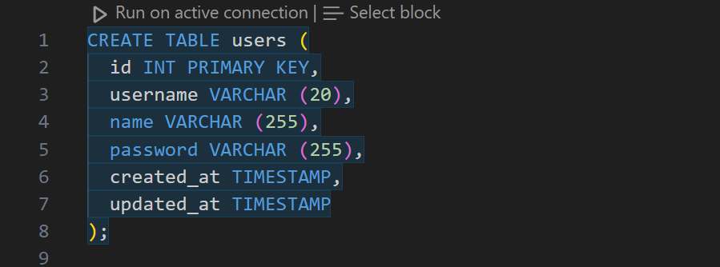
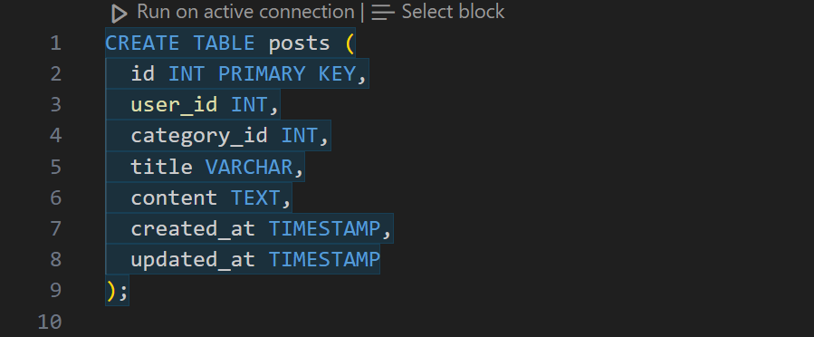
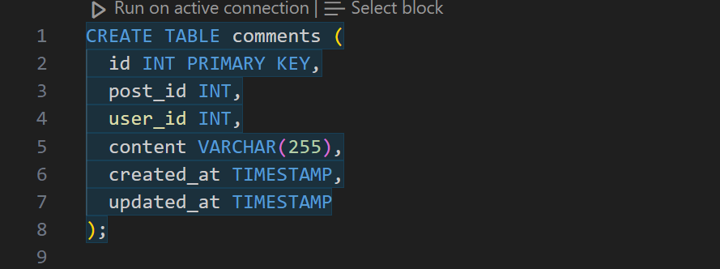
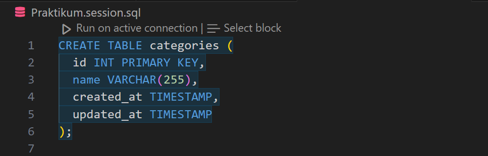
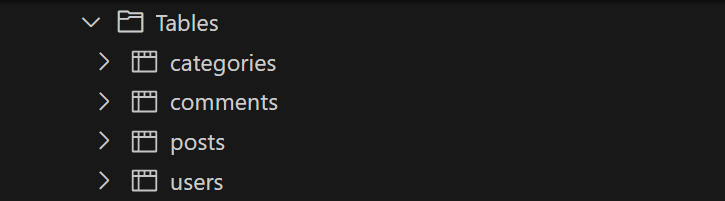

# SOAL PRIORITAS 1 (Nilai 80)

1. Sebutkan dan jelaskan tantangan yang perlu dihadapi dalam penggunaan Data Warehouse!

Jawab:

Penggunaan Data Warehouse memiliki tantangan-tantangan tersendiri yang perlu dihadapi. Salah satunya adalah integritas data. Tantangan ini muncul karena data berasal dari berbagai sumber yang mungkin memiliki format yang berbeda-beda. Oleh karena itu, memastikan bahwa data yang dimasukkan ke dalam warehouse telah valid dan konsisten menjadi sebuah tantangan. Selain itu skalabilitas juga menjadi tantangan penting, Data Warehouse harus menangani volume data yang besar. Tantangan lainnya adalah manajemen metadata, metadata merupakan informasi tentang data yang disimpan di dalam warehouse seperti struktur, asal, dan hubungan antar data. Manajemen metadata yang efektif sangat penting untuk memudahkan pencarian dan analisis data. Selain itu keamanan juga menjadi perhatian utama, oleh karena itu perlindungan terhadap data dari akses yang tidak sah atau ancaman lainnya menjadi tantangan yang perlu diatasi.

2. Berdasarkan diagram ERD pada LMS, buatlah berbagai tabel dengan menggunakan Citus.

Jawab:

- Langkah pertama membuat database citus (postgres) dan menjalankannya terlebih dahulu.
- Selanjutnya hubungkankan database dengan extention SQLTools pada Visual Studio Code.
Langkah pertama input data sesuai database yang sudah dibuat

Melakukan test connection, pastikan tampilan success

Lalu klik connect now untuk menghubungkan databasenya

- Setelah terhubung bisa membuat tabel dengan kriteria pada ERD di LMS
Membuat tabel users

Membuat tabel ports

Membuat tabel comments

Membuat tabel categories

Melihat tabel yang sudah dibuat

