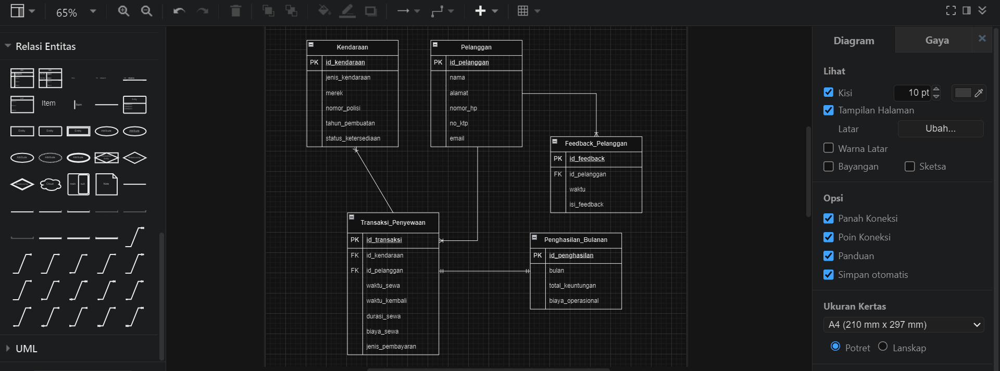
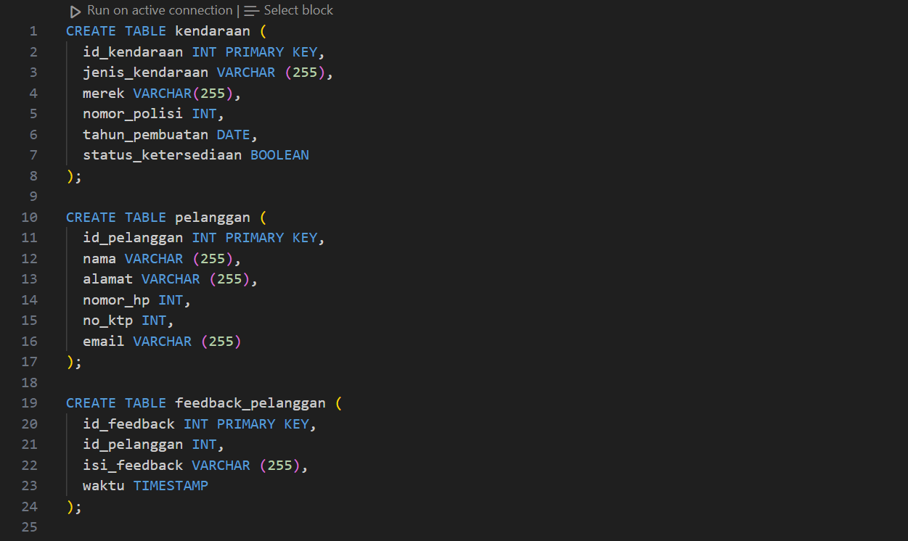
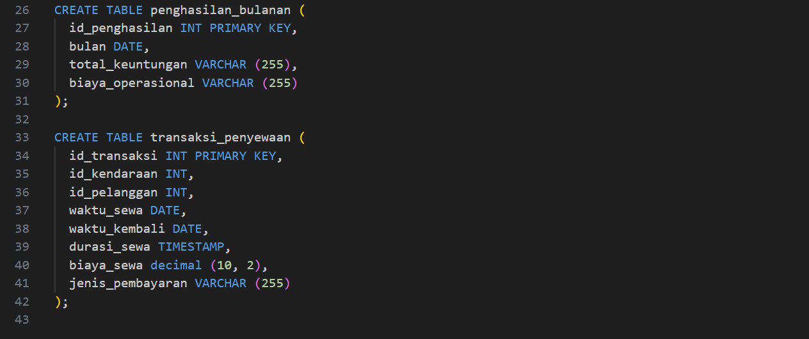
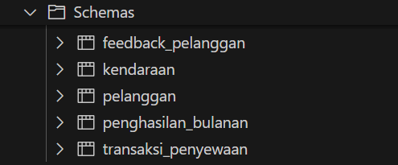

# SOAL PRIORITAS 2 (Nilai 20)

1. Membuat rancangan skema database dalam bentuk diagram ERD pada soal di LMS!

Berikut rancangan skema yang dibuat pada draw.io

2. Berdasarkan diagram ERD yang sudah dibuat pada nomor 1, buatlah berbagai tabel dengan kriteria sebagai berikut:

- Menggunakan Citus dalam pembuatan tabel.

- Menerapkan replication.
Replication pada Tabel Pelanggan

- Menerapkan sharding.
Sharding pada Tabel Transaksi Penyewaan
