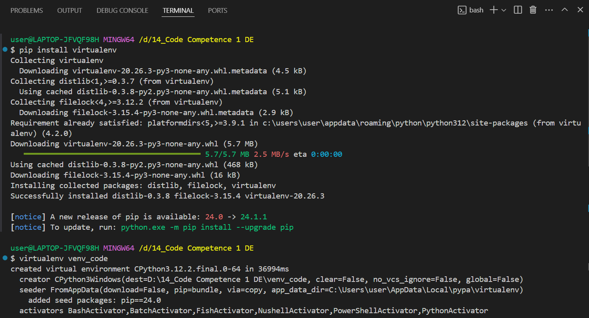
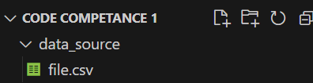
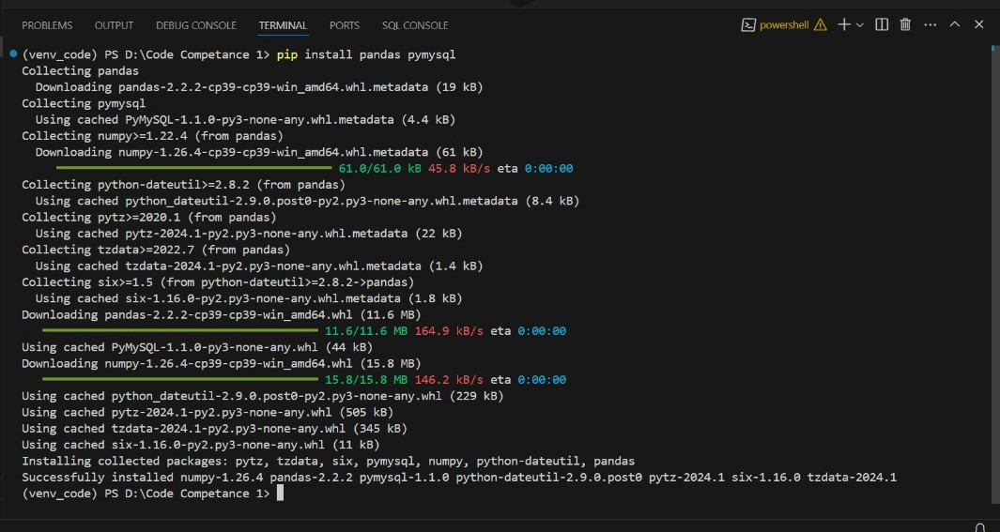
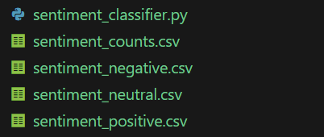
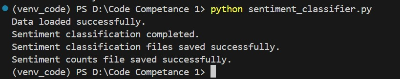
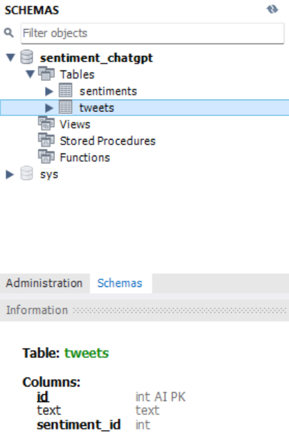
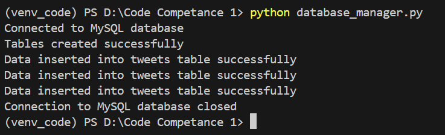
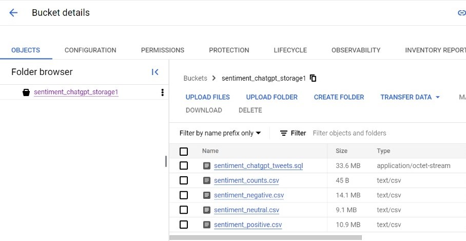

# LANGKAH-LANGKAH PENGERJAAN CODE COMPETANCE 1

1.  Persiapan Lingkungan Pengembangan
    - Buat virtual environment dengan Python dan namai sebagai venv_code untuk mengisolasi proyek.
    

    - Download dataset ChatGPT Sentiment Analysis dari tautan ini kemudian simpan kedalam folder data_source, yang terdiri dari atribut tweets sebagai teks tweet dan label yang merupakan penanda sentimen (good,bad,neutral).
    
    

2. Persiapan dan Pemrosesan Dataset dengan OOP
    Menginstall library pandas dan pymysql
    

    Bangun class SentimentClassifier dalam Python didalam file sentiment_classifier.py yang memiliki metode untuk membaca dan memproses dataset.
    - Metode load_data() akan membaca dataset ke dalam struktur data yang sesuai.
    - Metode classify_sentiment() akan membagi tweets ke dalam kategori good, bad, atau neutral.
    - Metode save_to_csv() akan menyimpan tweets yang diklasifikasikan ke dalam file CSV terpisah: sentiment_good.csv, sentiment_bad.csv, dan sentiment_neutral.csv.
    - Hitung dan simpan jumlah tweets untuk masing-masing kategori sentimen ke dalam file sentiment_counts.csv menggunakan metode summarize_counts().
    
    
    

3. Penyimpanan Data
    Desain skema database dengan tabel yang saling berelasi:
    - tweets (id, text, sentiment_id)
    - sentiments (sentiment_id, sentiment_label)
    - Pastikan sentiment_id di tabel tweets merupakan foreign key yang merujuk ke sentiments.
    
    

    Buat class Python DatabaseManager didalam file database_manager.py dengan library SQLAlchemy atau pymysql (jika menggunakan mysql) yang memiliki metode:
    - create_tables untuk mendefinisikan dan membuat tabel-tabel di atas jika belum ada.
    - insert_from_csv untuk membaca data dari CSV dan menginsert-nya ke dalam database sesuai tabel yang relevan.
    - Dokumentasi masing-masing tabel hasil insert dalam bentuk screenshot
    

4. Integrasi dengan Google Cloud Storage:
    Buat satu bucket di Google Cloud Storage, dengan nama sentiment_chatgpt_storage1, untuk menyimpan semua file yang relevan:
    sentiment_positive.csv
    sentiment_negative.csv
    sentiment_neutral.csv
    sentiment_counts.csv
    Backup database sentiment_chatgpt_tweets.sql
    
    
