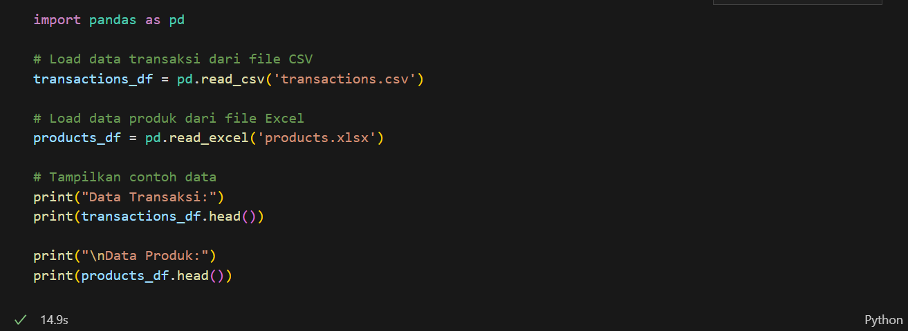
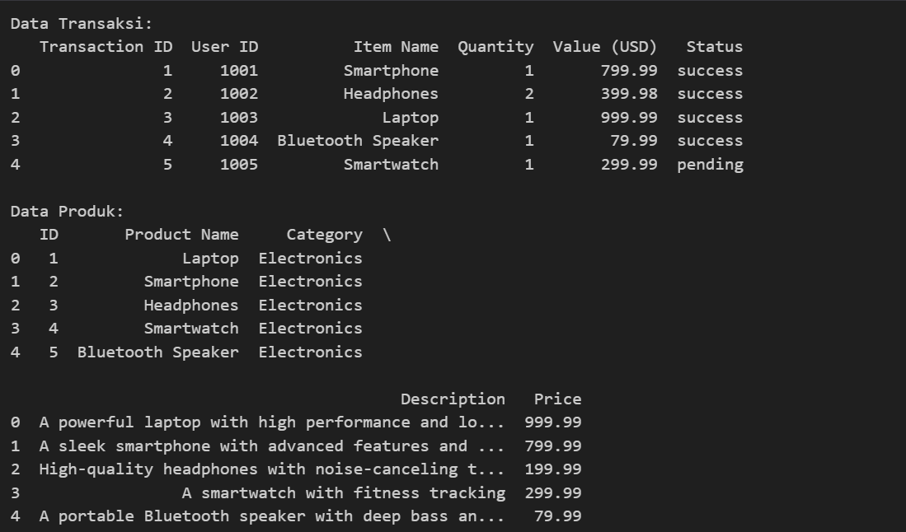
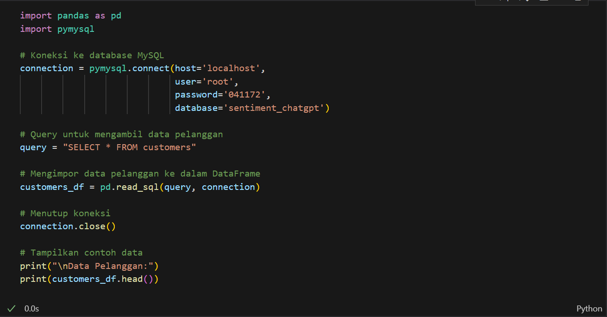
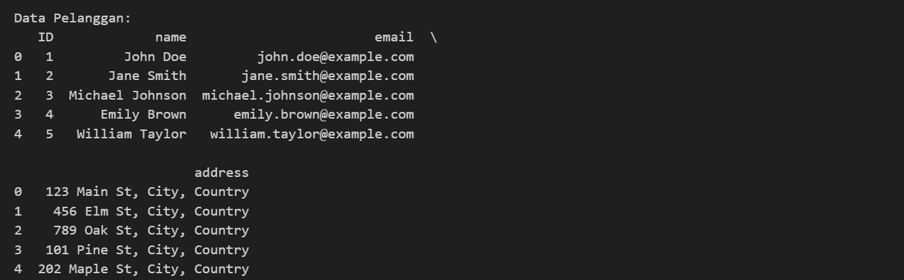
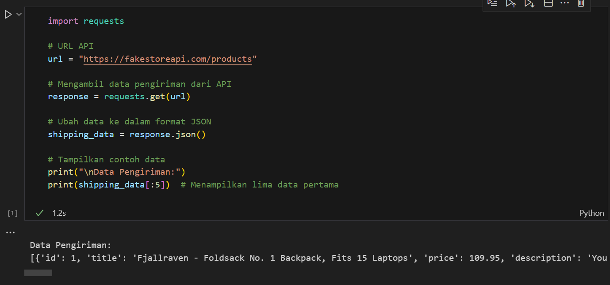
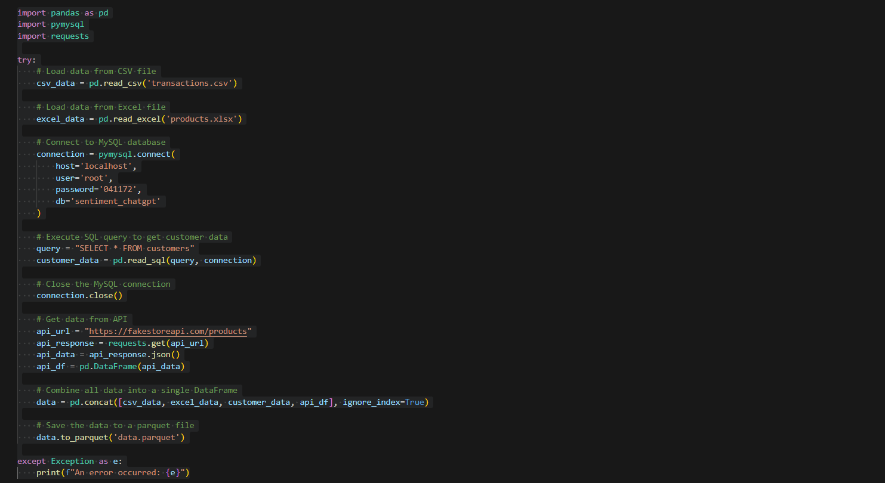
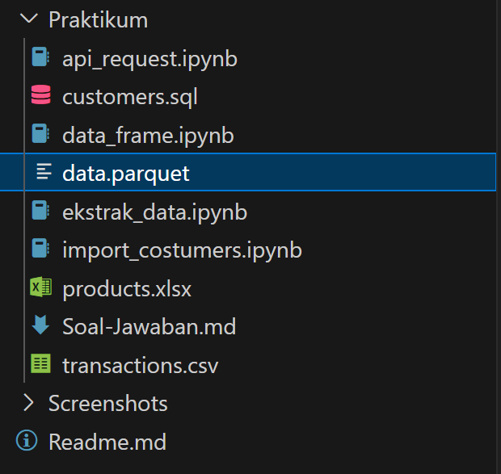
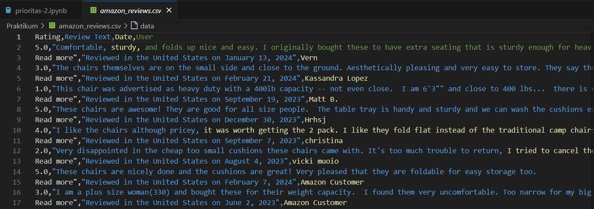
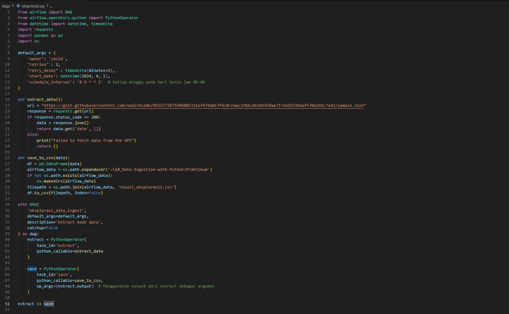

# Soal Jawaban Data Ingestion Python

- Soal Prioritas 1 (Nilai 80)

Ekstrak data transaksi e-commerce dari file CSV dan data produk dari file Excel.
Untuk diatas gunakan dataset yang telah disediakan dengan nama products.xlsx dan transactions.csv

Gunakan pymysql untuk mengimpor data pelanggan dari database MySQL.
Jalankan kode SQL yang telah disediakan dengan nama customers.sql untuk menambahkan data pelanggan ke dalam database MySQL.

Ambil data pengiriman dari API berikut:
https://fakestoreapi.com/products menggunakan requests.

Simpan semua data yang diingest ke dalam Pandas DataFrame dan ekspor ke file Parquet.

- Soal Prioritas 2 (Nilai 20)

Persiapan Lingkungan Pengembangan:
Pastikan Python sudah terinstal di sistem Anda.
Install library yang diperlukan: requests untuk mengirim permintaan HTTP, dan beautifulsoup4 untuk parsing HTML.

Pemilihan Situs E-commerce dan Produk:
Pilih situs e-commerce yang akan di-scrape (misalnya, Amazon, Tokopedia, dll.).
Tentukan produk spesifik yang ulasannya ingin Anda kumpulkan.

Ekstraksi Data Ulasan:
Gunakan library requests untuk mengirim permintaan ke halaman produk.
Dengan BeautifulSoup, parse HTML yang diterima untuk mengekstrak informasi ulasan, seperti rating, teks ulasan, tanggal ulasan, dan nama pengguna.

Penanganan Pagination:
Jika ulasan produk terdapat di beberapa halaman, implementasikan logika untuk menelusuri setiap halaman.
Ekstrak data ulasan dari setiap halaman tersebut.

Pembersihan dan Penyimpanan Data:
Bersihkan data yang telah diekstrak dari tag HTML dan format yang tidak diperlukan.
Simpan data ulasan ke dalam format yang diinginkan, seperti CSV atau database.

- Soal Eksplorasi (Nilai 20)

Ekstraksi Data dari API:
Gunakan Python untuk mengirim permintaan HTTP ke https://gist.githubusercontent.com/nadirbslmh/8922f71875948802321ef479a017f4c0/raw/1fbbc4b3d55f8ae717eb197d9aaf530ed1bc7ed2/sample.json dan terima respons dalam format JSON.
Ekstrak data buku yang relevan dari respons JSON, seperti judul, pengarang, tahun terbit, dan genre.

Pembuatan DAG di Apache Airflow:
Buat DAG di Apache Airflow untuk menjadwalkan dan mengotomatisasi proses ekstraksi data ini.
Tentukan jadwal eksekusi menggunakan cron expression, misalnya setiap minggu pada hari Senin jam 09:00.

Integrasi Skrip Python untuk Ekstraksi Data:
Integrasikan skrip Python yang telah Anda buat untuk ekstraksi data ke dalam task di Airflow menggunakan PythonOperator.

Pengujian dan Monitoring:
Jalankan DAG dan monitor prosesnya melalui UI Airflow.
Pastikan data berhasil diambil dan diolah sesuai jadwal yang ditentukan.

