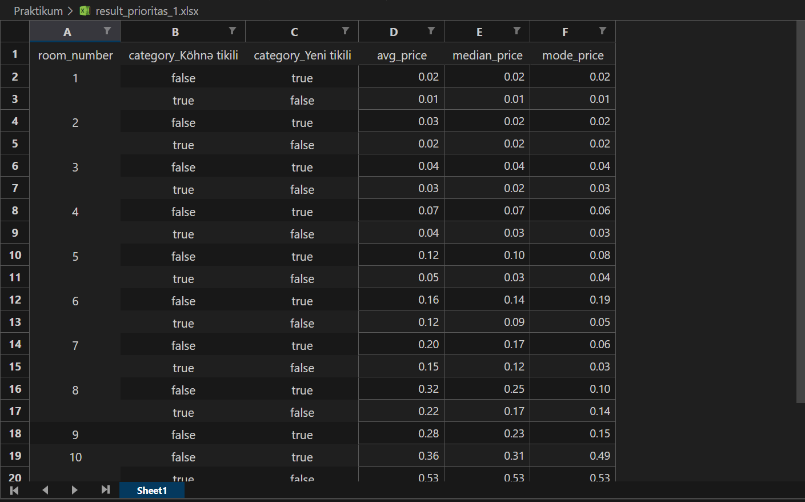
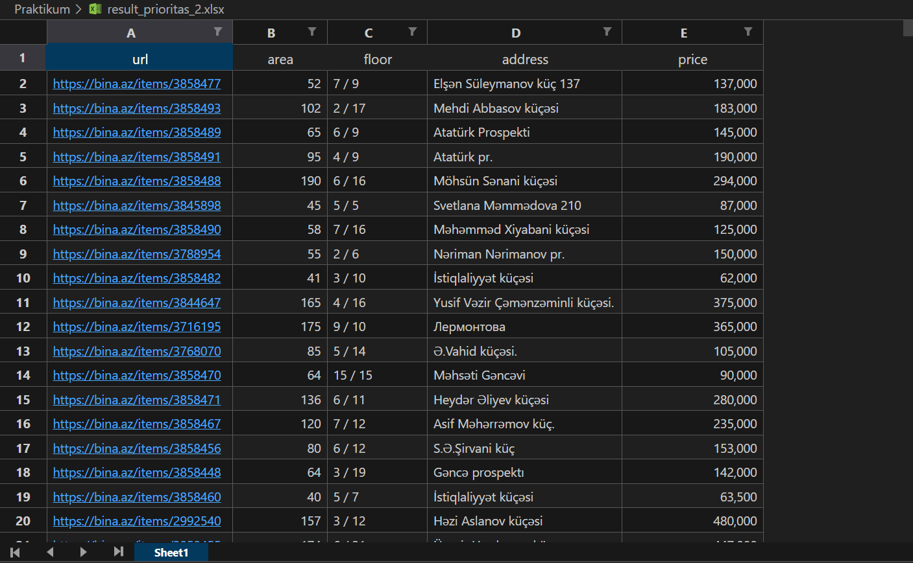
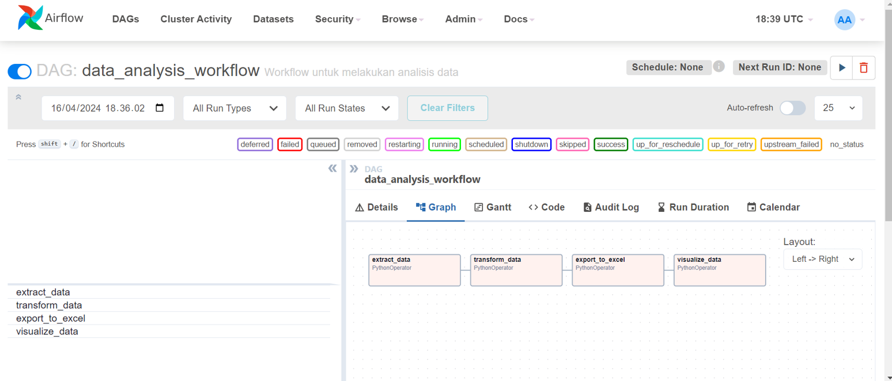

# Soal Jawaban Data Transformasi

- Soal Prioritas 1 (Nilai 80)

Analisis dan Transformasi Data Listing Rumah:

Normalisasi Data: Normalisasi harga rumah dan harga per meter persegi menggunakan teknik Min-Max.

Encoding Data Kategorikal: Terapkan one-hot encoding pada kolom 'Category', 'title_deed', 'repair', dan 'mortgage'.

Aggregasi Data: Hitung rata-rata, median, dan modus dari harga rumah berdasarkan jumlah kamar dan tipe bangunan.

Result:

- Soal Prioritas 2 (Nilai 20)

Mengatasi Tantangan Transformasi Data:

Mengelola Nilai yang Hilang: Identifikasi dan imputasi nilai yang hilang pada kolom 'area' dan 'floor'.

Mengatasi Outlier: Gunakan metode IQR untuk mengidentifikasi dan menangani outlier pada harga rumah.

Menjaga Integritas Data: Verifikasi dan validasi keakuratan data pada kolom 'address' dan 'url'.

Result:

- Soal Eksplorasi (Nilai 20)

Implementasi Airflow untuk Automasi Workflow:

Pengaturan Airflow:
Instalasi dan konfigurasi Apache Airflow.
Buat DAG (Directed Acyclic Graph) untuk mengatur workflow analisis data.

Task 1 - Ekstraksi Data:
Gunakan Python operator di Airflow untuk mengimpor dataset bebas dari repository seperti kaggle atau lainnya.

Task 2 - Transformasi Data dengan Pandas:
Lakukan transformasi data (normalisasi, encoding, handling missing values, dll.) menggunakan Pandas.

Ekspor Data ke Excel:
Task 3 - Ekspor Hasil Analisis:
Gunakan Pandas untuk mengekspor hasil analisis ke file Excel.
Atur task ini di Airflow untuk otomatisasi proses ekspor.

Visualisasi Data:
Task 4 - Visualisasi Data:
Buat visualisasi data menggunakan library seperti Matplotlib atau Seaborn.
Integrasikan pembuatan visualisasi ini dalam workflow Airflow.

Result:

