# Soal Jawaban Workflow Orchestration Airflow

Konfigurasi awal apache airflow dengan docker

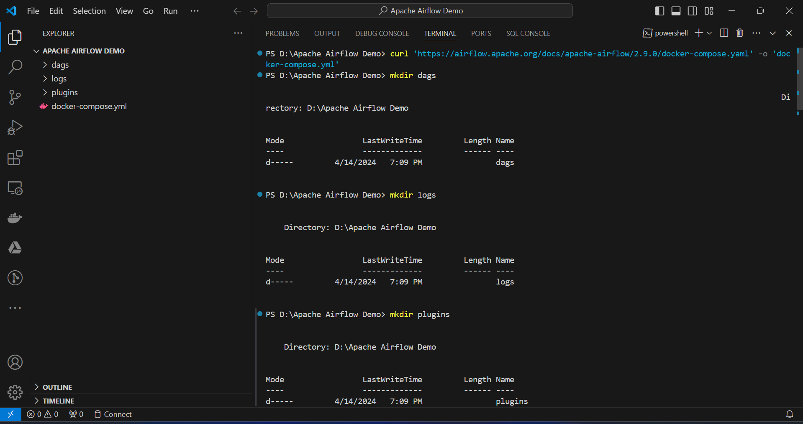

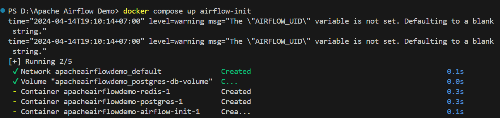

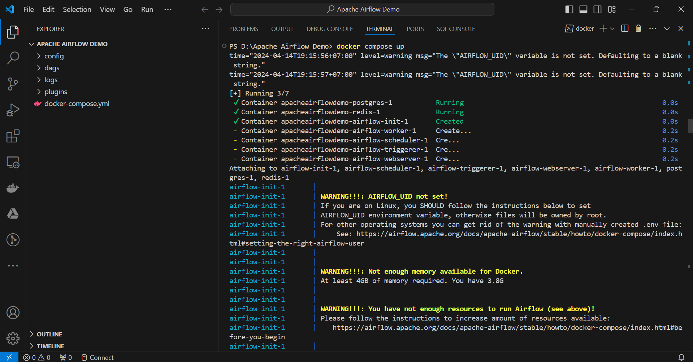

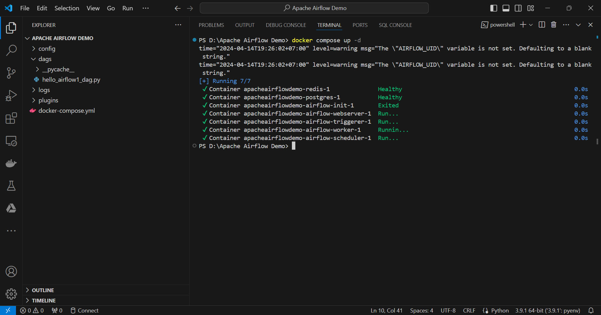

Login localhost:8080

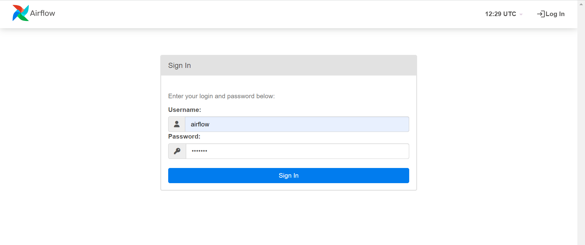

Soal Prioritas 1 No 1

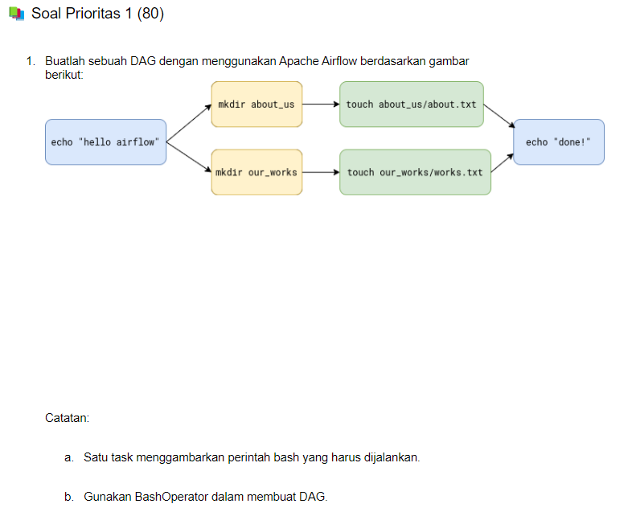

Jawaban:

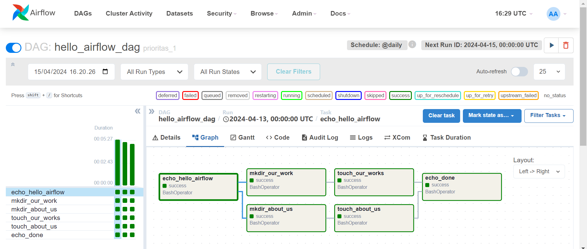

Soal Prioritas 1 No 2

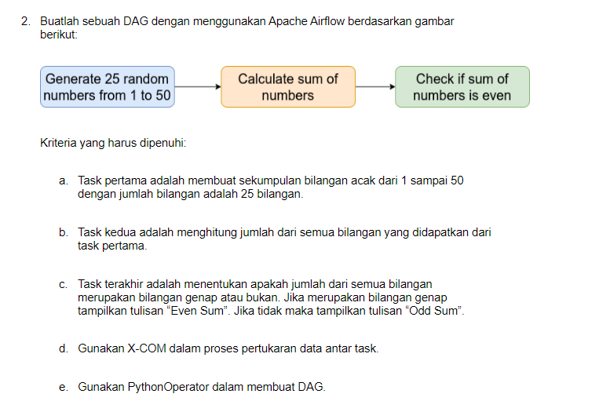

Jawaban:

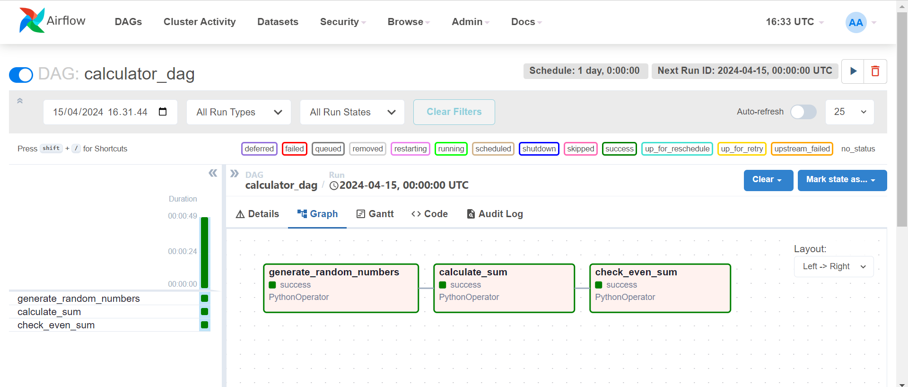

Soal Prioritas 2

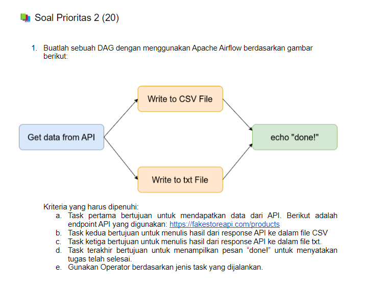

Jawaban:

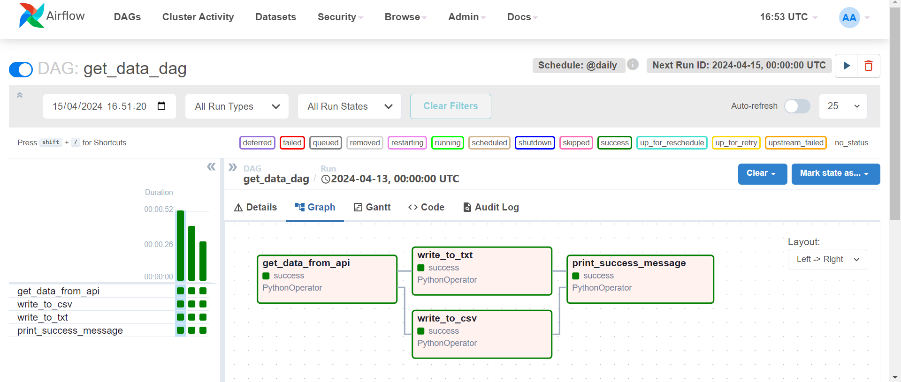

Soal Eksplorai

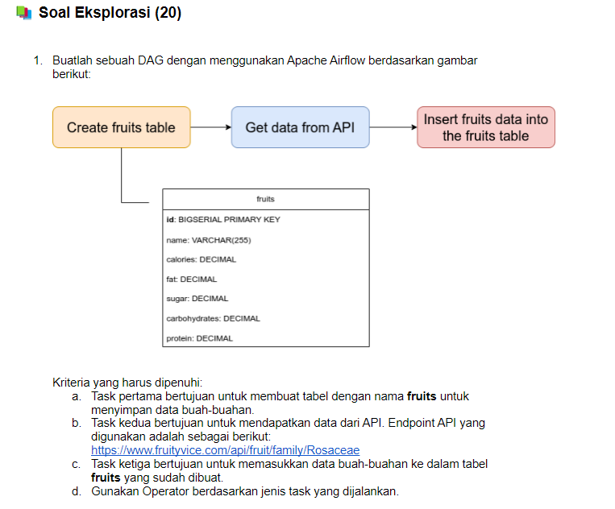

Jawaban:

Membuat connection

Konfigurasi postgres

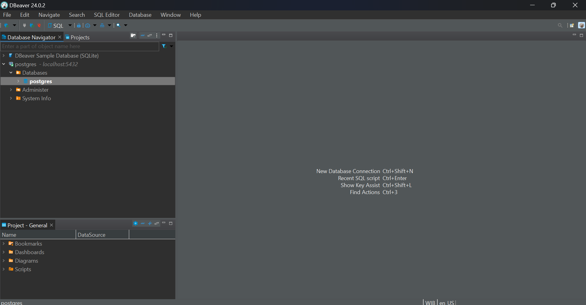

localhost:8080

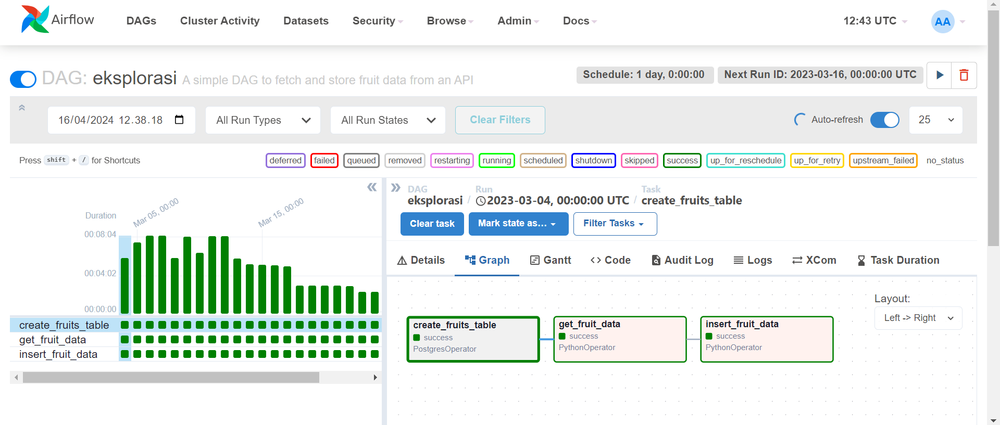
