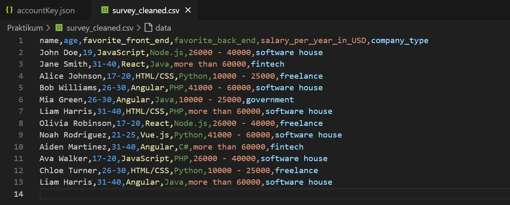
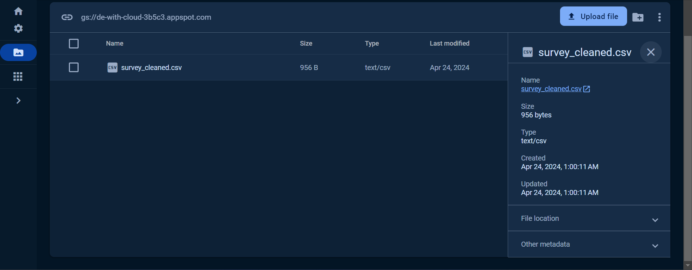
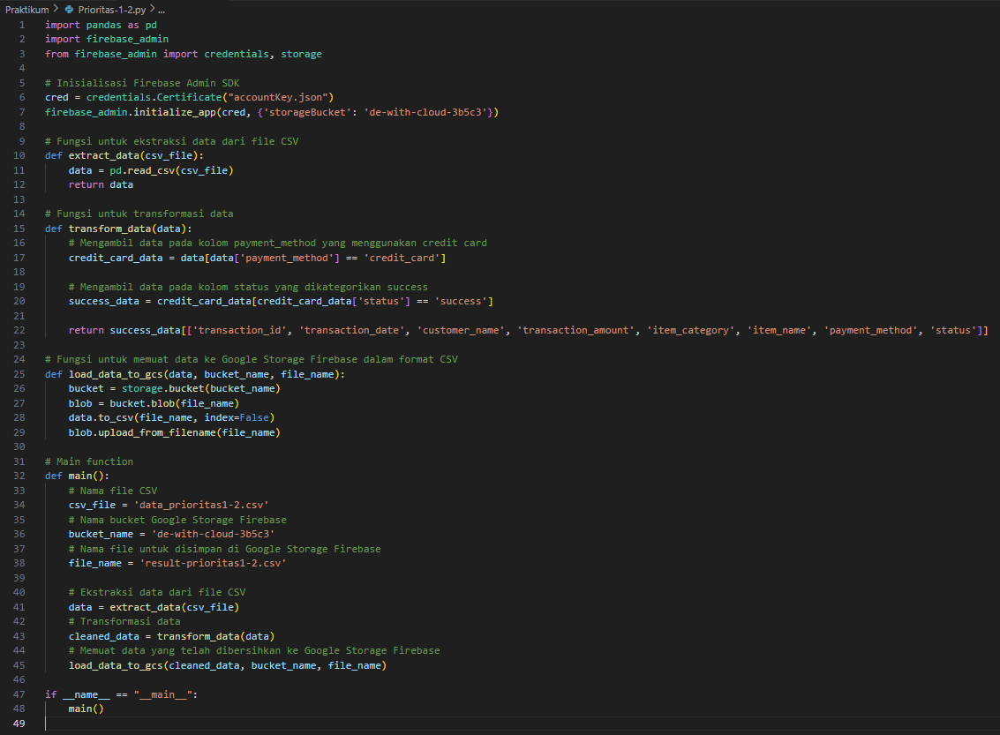
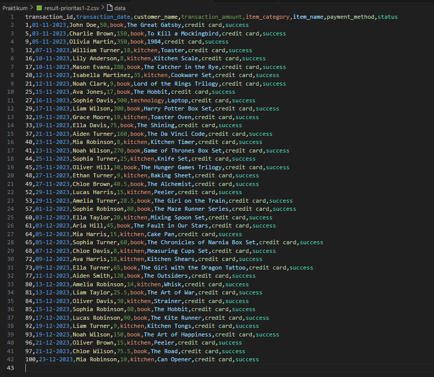
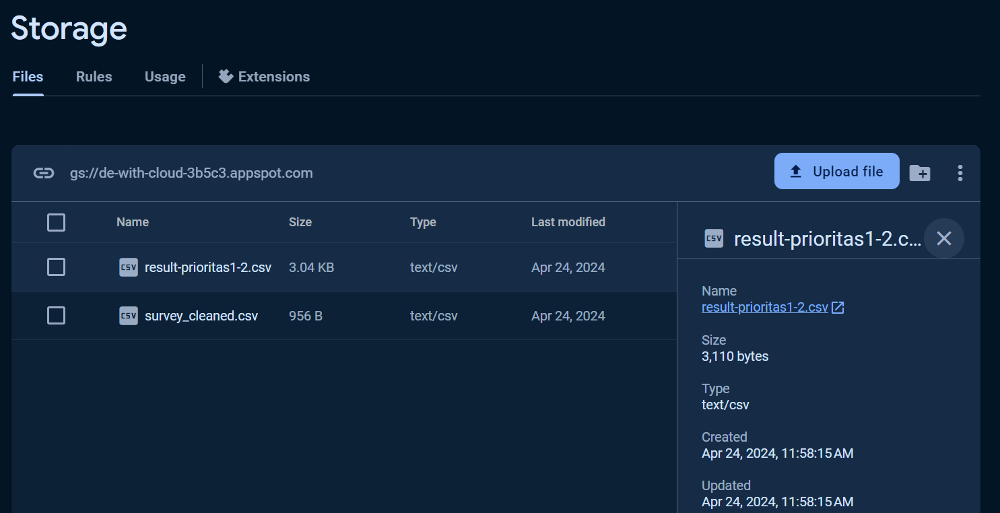
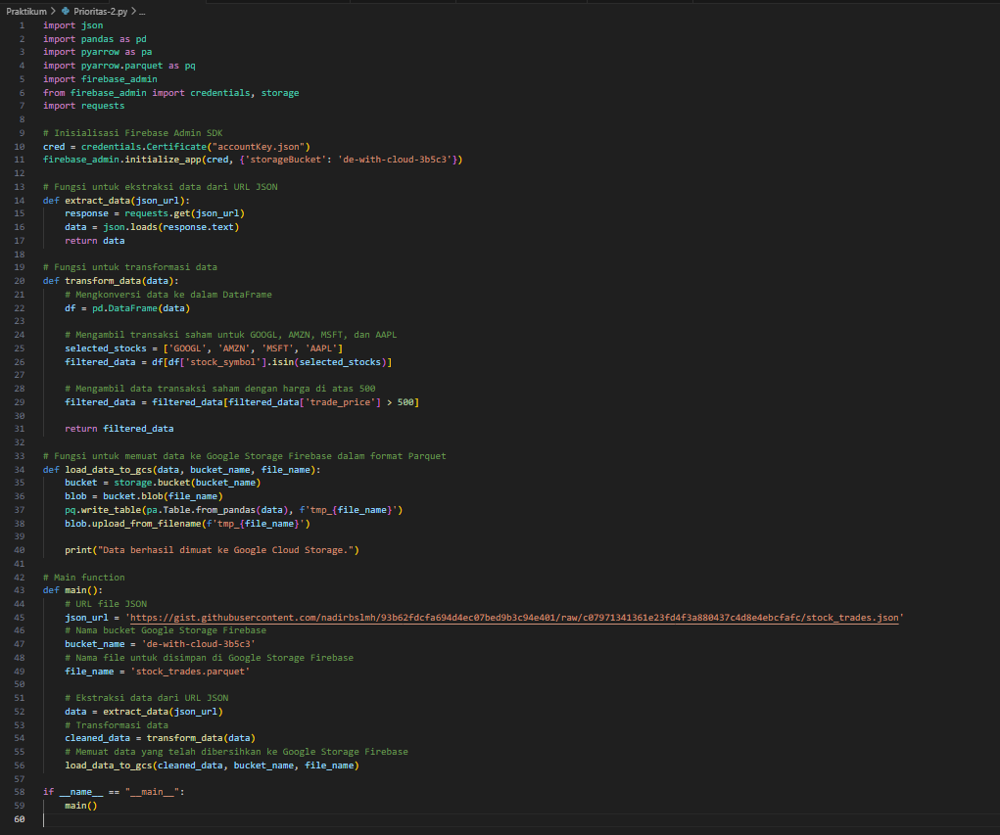
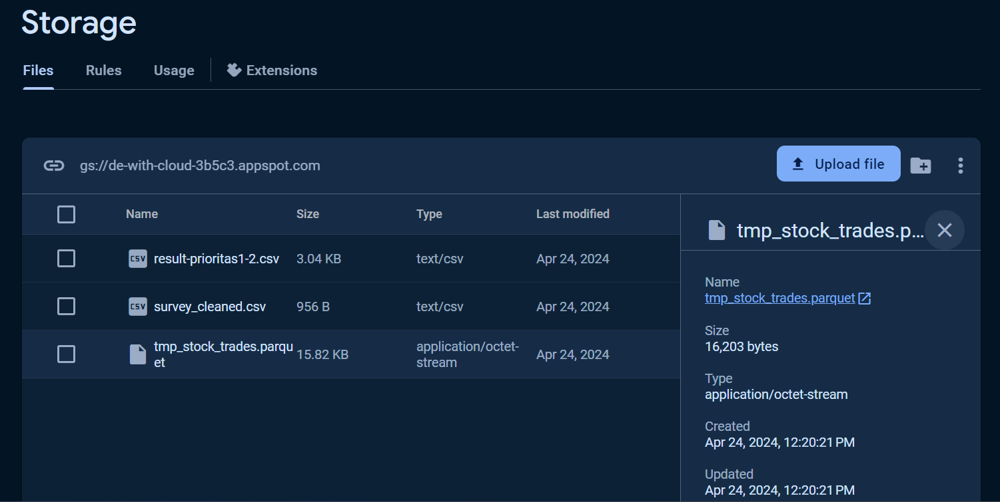
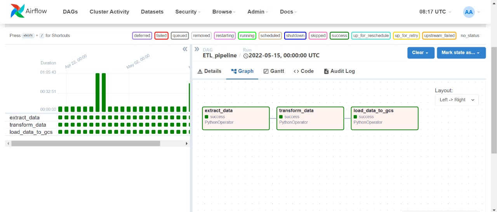

# Soal Jawaban Data Engineering in The Cloud

- Soal Prioritas 1 (80)

1. Sebuah survei mengenai pengembangan software telah dilakukan dan didapatkan data LMS. Buatlah sebuah pipeline ETL sederhana dengan kriteria berikut:

a. Lakukan proses ekstrak data dari csv.

b. Lakukan proses transformasi data. Transformasi bisa berupa proses data cleaning untuk menghindari data duplikat dan data yang tidak lengkap.

c. Lakukan proses load data dalam format csv ke dalam Google Storage.

Jawab:

2. Sebuah platform e-commerce telah merekap data transaksi pada LMS. Buatlah sebuah pipeline ETL sederhana dengan kriteria berikut:

Lakukan proses ekstrak data.

Lakukan proses transformasi data yaitu dengan mengambil data transaksi yang menggunakan metode pembayaran kartu kredit (credit card) dan status nya success.

Lakukan proses load data dalam format csv ke dalam Google Storage.

Jawab:

- Soal Prioritas 2 (20)

1. Sebuah data transaksi saham telah dikumpulkan dan disimpan pada file berikut. Buatlah sebuah pipeline ETL dengan kriteria berikut:

Lakukan proses ekstrak data.

Lakukan proses transformasi data yaitu:
    Ambil transaksi saham untuk GOOGL, AMZN, MSFT dan AAPL. Bisa mengacu pada atribut stock_symbol.
    Dari transaksi tersebut. Ambil data transaksi saham dengan harga transaksi (trade_price) diatas 500.

Lakukan proses load data dalam format parquet ke dalam Google Storage.

Jawab:

- Soal Eksplorasi (20)

1. Buatlah sebuah pipeline ETL berdasarkan skema berikut:

Kriteria dari pipeline ETL yang dibuat adalah sebagai berikut:

Data sampel yang digunakan adalah sebuah API dengan endpoint: https://fakestoreapi.com/products 

Menggunakan Apache Airflow dalam membangun pipeline ETL.

Terdapat proses ekstrak data dari API.

Terdapat proses transformasi data yaitu:
    Mengambil data produk dengan harga diatas 100.
    Menyimpan data produk berupa nama (title), harga (price), deskripsi (description) dan kategori (category).

Terdapat proses load data yang sudah ditransform dalam format parquet ke dalam Google Storage.

Jawab:

