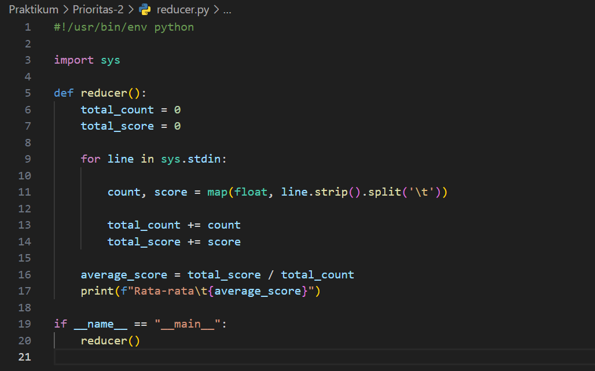
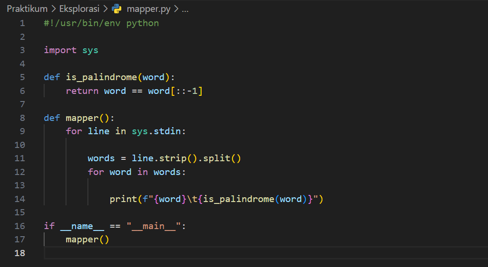

# Soal Jawaban Big Data Technologies

# Soal Prioritas 1 (80)

1. Sebutkan dan jelaskan berbagai tantangan yang perlu diperhatikan dalam penggunaan solusi Big Data!

Jawab:

Penggunaan solusi Big Data seperti Apache Hadoop memberikan banyak manfaat, tetapi juga menghadirkan beberapa tantangan yang perlu diperhatikan. Pertama, skalabilitas merupakan salah satu tantangan utama dalam penggunaan Apache Hadoop. Meskipun Hadoop dirancang untuk menangani volume data yang besar, tetapi memastikan sistem tetap berjalan lancar ketika data semakin bertambah merupakan tantangan tersendiri. Kedua, performa juga menjadi perhatian penting, karena ketika data semakin besar, waktu pemrosesan dan analisisnya juga bisa menjadi lebih lama. Selanjutnya, manajemen data yang efisien juga merupakan tantangan, termasuk dalam hal penyimpanan, pengelolaan, dan integrasi data yang beragam. Terakhir, masalah keamanan juga perlu diperhatikan yaitu dengan data yang sangat besar dan beragam, perlindungan terhadap data dari ancaman internal dan eksternal menjadi sangat krusial.
Referensi: http://www.mdmedia.co.id/whats-up/67/artikel/big-data-analytics-definisi-masa-depan-dan-tantangan

2. Sebuah perusahaan yang bergerak di bidang produksi makanan dan minuman ingin mendapatkan pengetahuan mengenai respons konsumen, apa yang diinginkan oleh konsumen dan data penjualan. Perusahaan tersebut ingin memanfaatkan penggunaan Big Data. Sebutkan aspek 5V dari Big Data berdasarkan kasus ini!

Jawab:

Dalam kasus penggunaan Big Data untuk menganalisis respons konsumen yaitu apa yang diinginkan oleh konsumen dan data penjualan pada perusahaan makanan dan minuman, terdapat beberapa aspek 5V yang perlu diperhatikan dalam implementasinya menggunakan Apache Hadoop. Pertama, dari segi volume, perusahaan akan menghadapi jumlah data yang besar, termasuk apa yang diinginkan oleh konsumen dan data penjualan. Apache Hadoop dapat mengelola volume data yang besar ini secara efisien. Kedua, dari segi velocity, data harus diproses dengan cepat untuk memberikan wawasan yang real-time tentang perilaku konsumen dan tren penjualan. Apache Hadoop dengan kemampuan pemrosesan data real-time dapat mengatasi kebutuhan akan kecepatan ini. Ketiga, dari segi variety, data yang dihadapi perusahaan beragam. Apache Hadoop dapat mengelola berbagai jenis data ini dengan fleksibilitas. Keempat, veracity, perusahaan harus memastikan keakuratan dan keandalan data yang dianalisis. Apache Hadoop menyediakan alat dan teknologi untuk memverifikasi dan membersihkan data yang tidak akurat. Terakhir, dari segi value, penggunaan Apache Hadoop diharapkan dapat menghasilkan wawasan yang bernilai bagi perusahaan, seperti pemahaman yang lebih baik tentang preferensi konsumen dan optimasi strategi pemasaran.
Referensi: https://dqlab.id/belajar-big-data-dengan-mengenal-5v

# Soal Prioritas 2 (20)

1. Buatlah sebuah program untuk menghitung rata-rata dari setiap sekumpulan nilai dengan kriteria sebagai berikut:
Menggunakan dataset pada LMS.
Menggunakan Apache Hadoop MapReduce.

Jawab:

# Soal Eksplorasi (20)

1. Buatlah sebuah program untuk mengecek apakah sebuah kata termasuk palindrom atau bukan dengan kriteria sebagai berikut:
Menggunakan dataset pada LMS.
Menggunakan Apache Hadoop MapReduce.
Jika sebuah kata termasuk palindrom maka tampilkan nilai “True”. Jika tidak tampilkan “False”.

Jawab:

