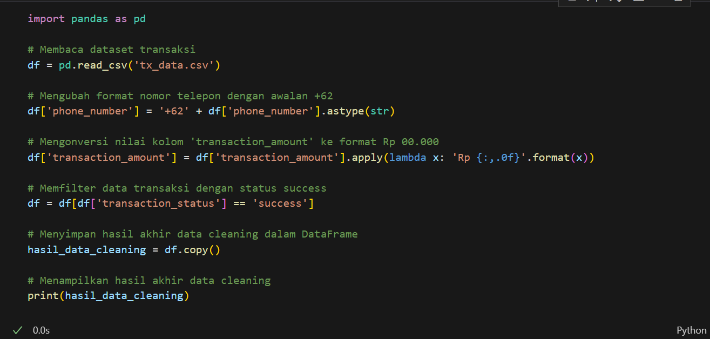
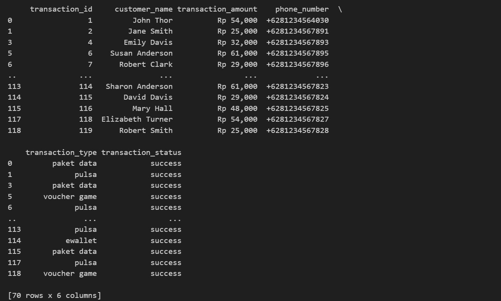
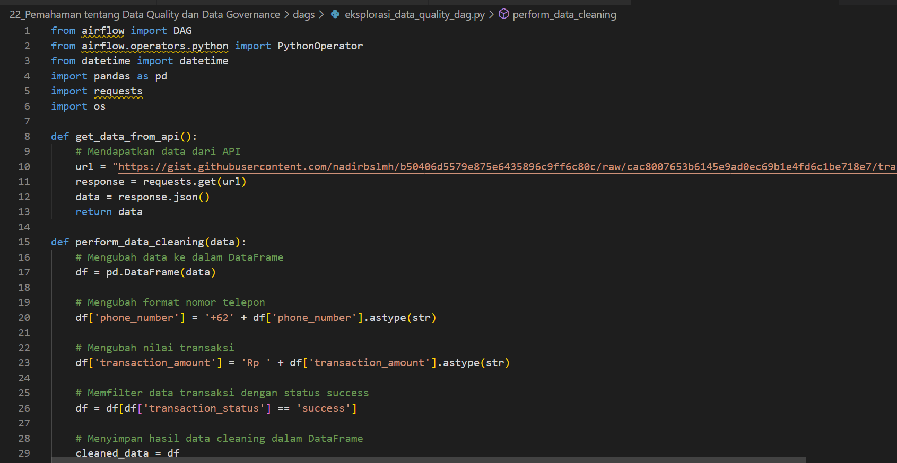
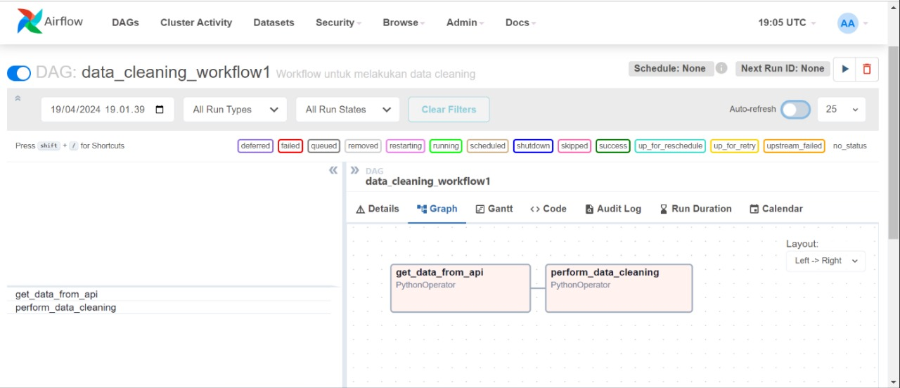

# Soal Jawaban Data Quality and Data Governance

- Soal Prioritas 1 (80)

1. Sebutkan dan jelaskan berbagai tools yang dapat digunakan untuk meningkatkan kualitas dari sebuah data!

Jawab: 

Berbagai tools dalam data quality untuk membantu meningkatkan kualitas data antara lain sebagai berikut:

Data Profiling Tools: (Trifacta, Datawatch, Open Profiler) membantu memahami karakteristik data, seperti format, nilai, dan distribusi, serta mengidentifikasi data yang hilang, tidak lengkap, atau tidak konsisten.

Data Cleansing Tools: (Informatica Data Quality, IBM InfoSphere Master Data Management, Profisee Data Quality) mengidentifikasi dan memperbaiki data yang salah atau tidak lengkap, serta melakukan koreksi data secara otomatis atau manual.

Data Matching Tools: (SAP Data Services, Oracle Data Quality, Azure Data Catalog) mencocokkan data dari sumber yang berbeda untuk mengidentifikasi duplikasi dan inkonsistensi, serta membantu dalam proses konsolidasi data dan master data management.

Data Monitoring Tools: (Datadog, Splunk, Qlik Sense) melacak kualitas data dari waktu ke waktu, mendeteksi dan memberi tahu tentang masalah kualitas data yang muncul.

Data Governance Tools: (Informatica Data Governance, IBM InfoSphere Data Governance, Collibra Data Governance) mendukung penerapan kebijakan dan prosedur Data Governance, membantu dalam mengelola akses data, keamanan, dan kepatuhan.

Data Quality Reporting jug merupakan bagian penting, laporan ini menyajikan temuan dari profiling data dan pengukuran metrik kualitas data lainnya. Laporan ini membantu pemangku kepentingan memahami status kualitas data saat ini, mengidentifikasi tren, dan melacak kemajuan inisiatif peningkatan kualitas data.
Referensi: https://lakefs.io/data-quality/data-quality-tools/

2. Terdapat berbagai cara dalam meningkatkan kualitas dari sebuah data (data quality) seperti data governance, data profiling dan data matching. Dari berbagai cara tersebut, sebutkan berbagai tantangan yang perlu diperhatikan!

Jawab:

Cara untuk meningkatkan kualitas data, seperti data governance, data profiling, dan data matching, memiliki tantangan tersendiri yang perlu diperhatikan. Pertama, dalam konteks data governance, tantangan utamanya adalah mengimplementasikan kerangka kerja yang efektif dan memastikan kepatuhan dari berbagai sumber kepentingan dalam organisasi. Hal ini melibatkan pembentukan kebijakan, prosedur, dan peran yang jelas dalam pengelolaan data serta memastikan ketersediaan sumber daya yang cukup. Kedua, dalam data profiling, tantangannya adalah menghadapi kompleksitas data yang tinggi dan volume data yang besar, sehingga memerlukan teknologi dan algoritma analisis yang canggih untuk mengidentifikasi pola, anomali, dan masalah kualitas data dengan akurat. Terakhir, dalam data matching, tantangannya adalah memastikan keakuratan dan ketepatan dalam mencocokkan data dari berbagai sumber yang berbeda, yang seringkali melibatkan perbedaan format, struktur, dan kualitas data antar sumber.
Referensi: https://www.ibm.com/topics/data-quality

- Soal Prioritas 2 (20)

1. Lakukan proses data cleaning dengan kriteria sebagai berikut:
- Menggunakan dataset transaksi pada LMS.
- Mengubah format nomor telepon dengan awalan +62 di depan. Contohnya seperti ini: +6281234567891
- Mengubah nilai transaksi (transaction_amount) dengan format seperti berikut: Rp 12.000
- Pastikan data yang diambil adalah data transaksi dengan status sama dengan success.
- Proses data cleaning dapat menggunakan library Pandas.
- Hasil akhir data cleaning disimpan di dalam DataFrame.

Jawab:

Code ipynb:

Result:

- Soal Eksplorasi (20)

1. Lakukan proses data cleaning pada sebuah workflow yang diilustrasikan sebagai berikut:

get data from API>>perform data cleaning

Kriteria yang harus dipenuhi:

Menggunakan Apache Airflow dalam menyusun DAG berdasarkan workflow diatas.

Menggunakan API endpoint https://gist.githubusercontent.com/nadirbslmh/b50406d5579e875e6435896c9ff6c80c/raw/cac8007653b6145e9ad0ec69b1e4fd6c1be718e7/transactions.json.

Jenis Operator yang digunakan bebas / bisa disesuaikan.

Mengubah format nomor telepon dengan awalan +62 di depan. Contohnya seperti :+6281234567891 pada kolom phone_number.

Mengubah nilai transaksi dengan format seperti berikut: Rp 12.000 pada kolom transaction_amount.

Pastikan data yang diambil adalah data transaksi dengan status sama dengan success pada kolom transaction_status.

Proses data cleaning dapat menggunakan library Pandas.

Hasil akhir data cleaning disimpan di dalam DataFrame.

Jawab:

Code Python:

DAG:

