# Soal Jawaban Data Visualization

- Soal Prioritas 1 (80)
1. Buatlah sebuah data visualization dari dataset pada LMS dengan kriteria:
Membuat sebuah line plot untuk menggambarkan jumlah nilai dari transaksi per hari.
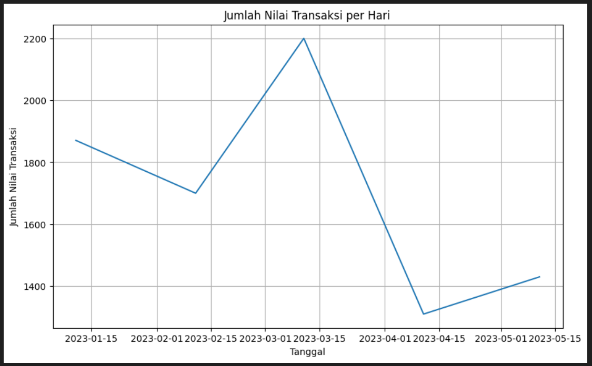
Membuat sebuah bar plot untuk menggambarkan jumlah customer per hari.
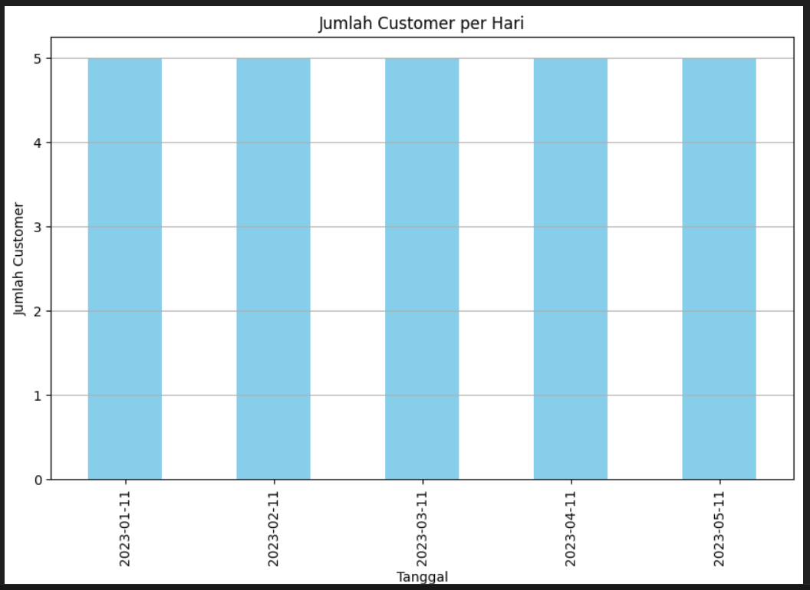
Membuat sebuah scatter plot untuk menggambarkan jumlah nilai dari transaksi per hari.
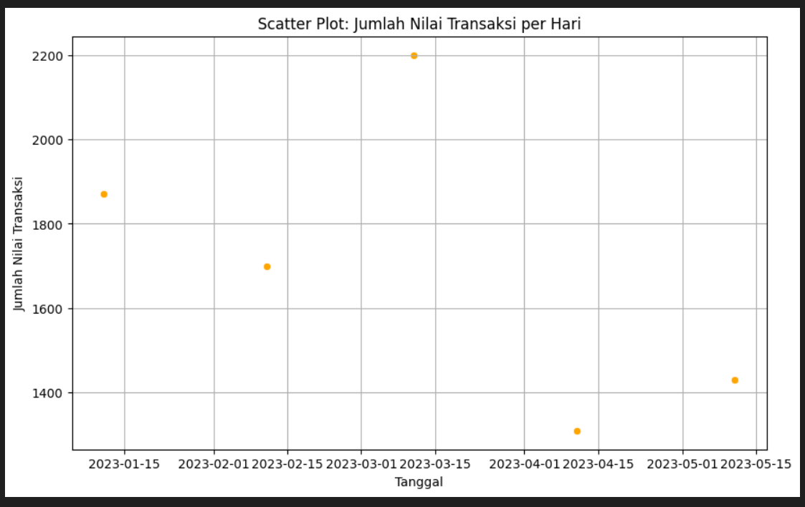
Untuk setiap poin di atas boleh menggunakan library yang berbeda / tidak harus sama.

2. Sebuah toko roti / bakery telah merekap data transaksi pada LMS. Toko tersebut ingin mendapatkan informasi berikut:
Jumlah nilai transaksi per hari.
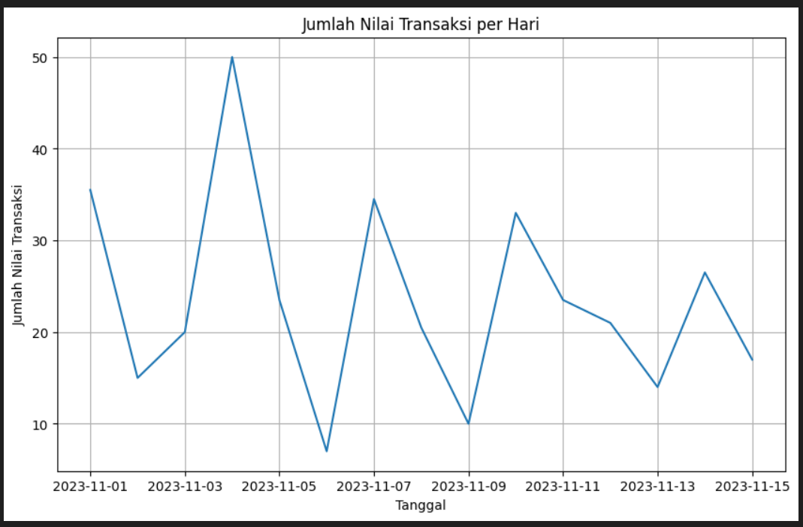
Jenis roti yang paling banyak dipesan.
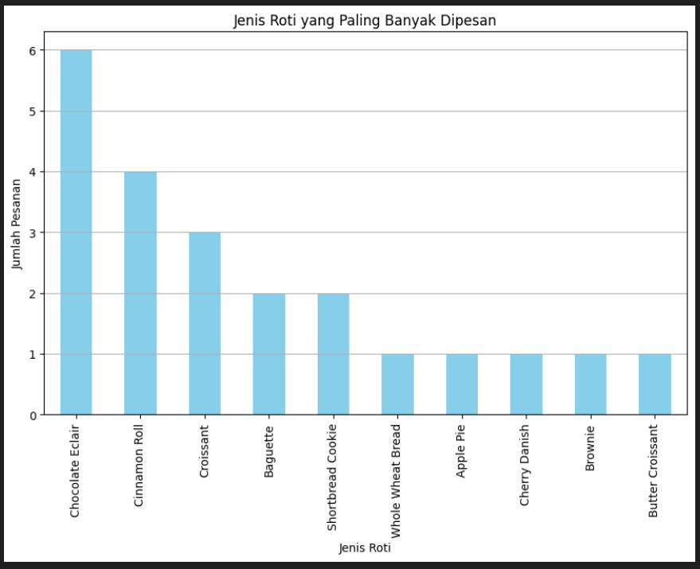
Rata-rata kepuasan pelanggan (customer_rating) per hari.
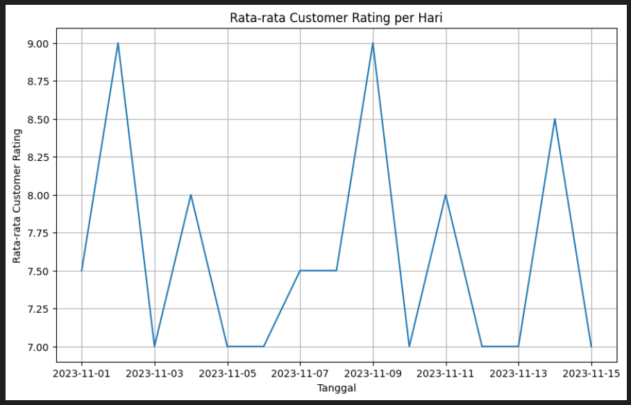
Berdasarkan poin-poin tersebut, buatlah data visualization untuk memperoleh informasi tersebut.

- Soal Prioritas 2 (20)
1. Sebuah platform e-commerce telah merekap data transaksi pada LMS. Platform tersebut ingin mendapatkan informasi berikut:
Jumlah nilai transaksi per hari.
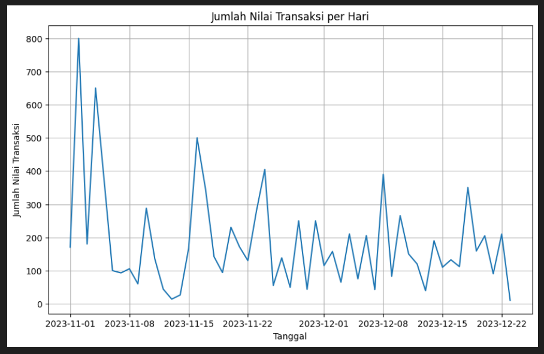
Kategori barang yang paling banyak dibeli.
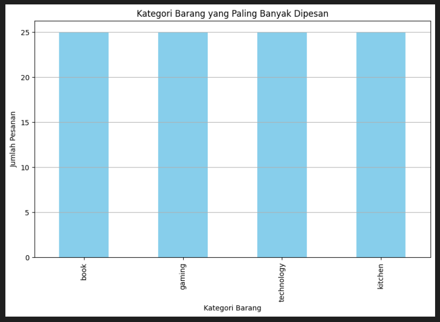
Jumlah nilai transaksi dengan metode pembayaran e-wallet.
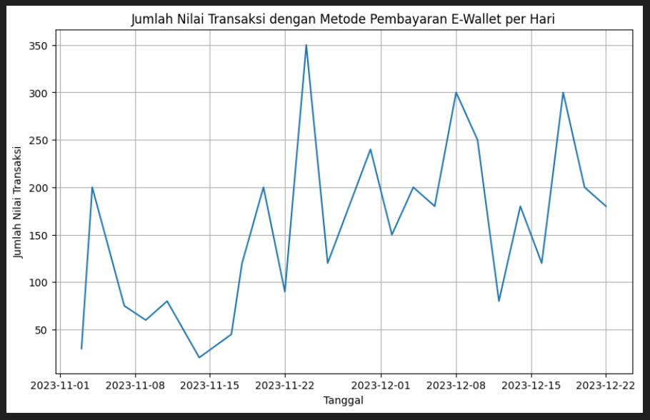
Nilai maksimal, nilai minimal dan nilai tengah dari jumlah nilai transaksi yang dilakukan.
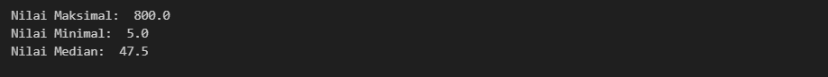
Berdasarkan poin-poin tersebut, buatlah data visualization untuk memperoleh informasi tersebut.

2. Sebuah survei mengenai pengembangan software telah dilakukan dan didapatkan data pada LMS. Buatlah data visualization untuk memperoleh berbagai informasi berikut:
Persentase responden berdasarkan umur.
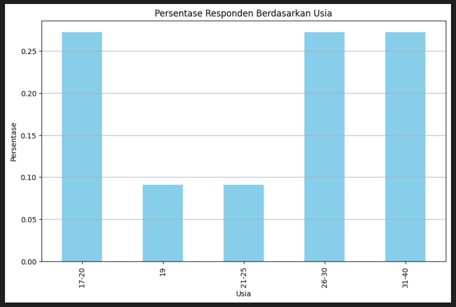
Bahasa pemrograman / framework yang paling banyak digunakan dalam pengembangan front end.
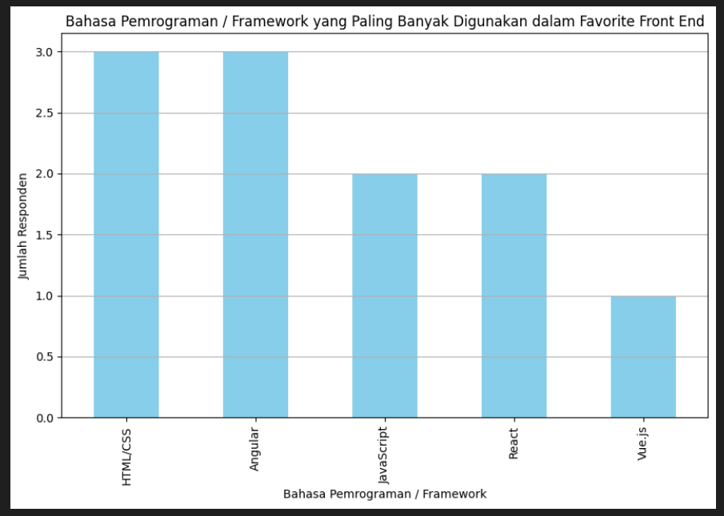
Bahasa pemrograman / framework yang paling banyak digunakan dalam pengembangan back end.
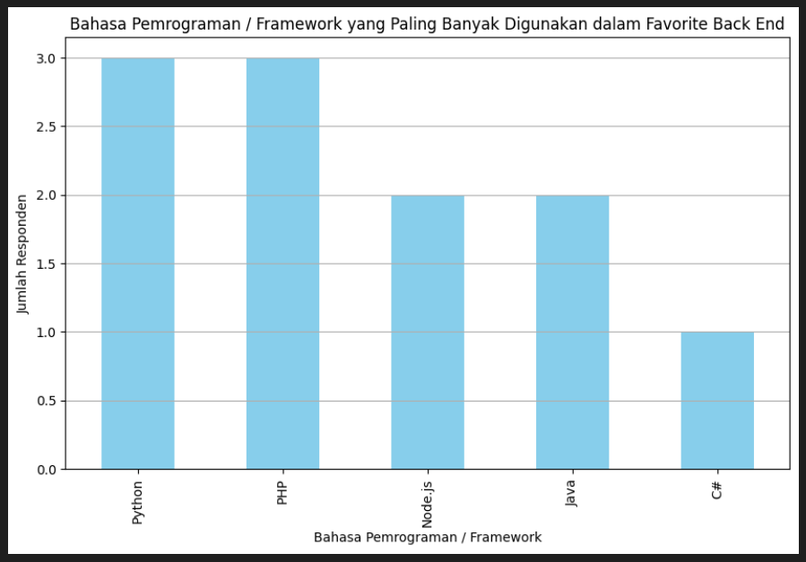
Persentase bahasa pemrograman / framework yang dipilih dalam pengembangan front end.
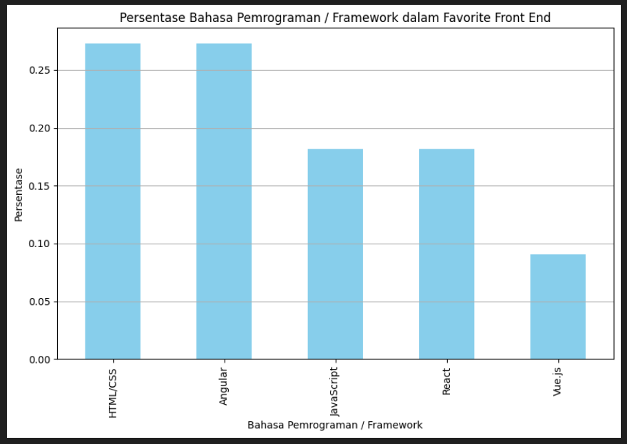
Rentangan gaji per tahun yang paling banyak berdasarkan hasil survei.
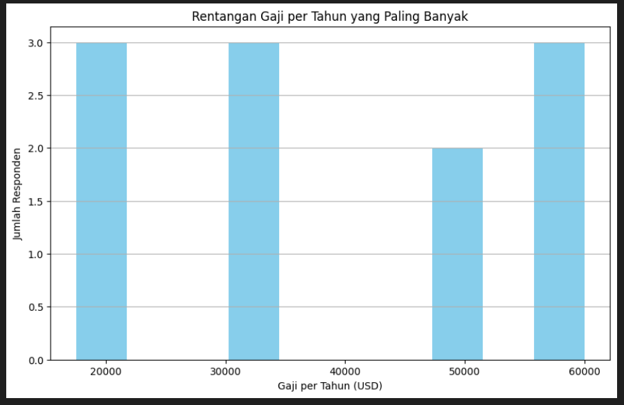
Pastikan data survei sudah diproses untuk menghindari data duplikat dan data dengan atribut yang tidak lengkap.

- Soal Eksplorasi (20)
1. Sebuah data transaksi saham telah dikumpulkan dan disimpan pada file di LMS. Buatlah data visualization untuk mendapatkan informasi berikut:
Harga beli saham yang tertinggi dalam rupiah (IDR). Pastikan semua nilai transaksi sudah dikonversi dalam satuan rupiah.
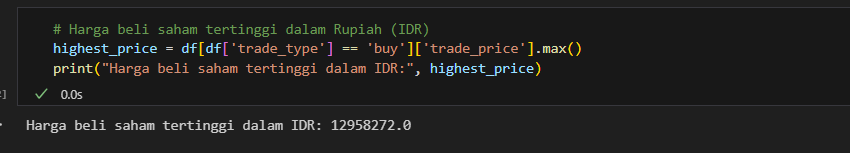
Perkembangan transaksi pembelian saham TSLA.

Persentase jenis saham yang dilakukan proses jual-beli. Jenis saham dapat dilihat pada bagian stock_symbol.
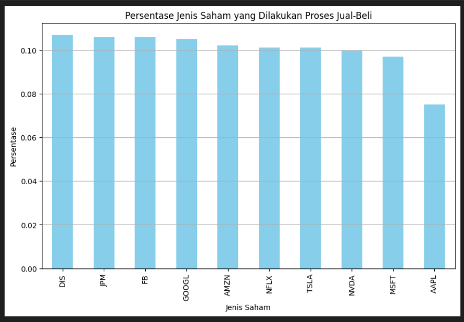
Jenis transaksi yang banyak dilakukan (buy / sell).

Persentase jenis transaksi yang dilakukan.
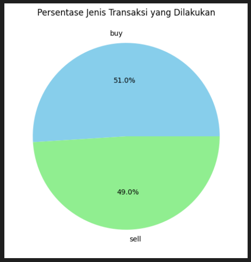
Rata-rata nilai transaksi jual pada setiap tahun untuk semua jenis saham.
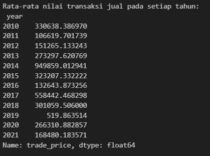
