# Soal Jawaban Introduction AI on Data Engineer Eksplorasi

- Soal Eksplorasi (Nilai 20)
Anda bekerja sebagai Data Engineer di sebuah perusahaan e-commerce. Perusahaan Anda ingin meningkatkan efisiensi sistem rekomendasi produknya. Sistem saat ini mengalami kesulitan dalam mengidentifikasi pola pembelian pelanggan dan memberikan rekomendasi yang relevan.

1. Analisis Masalah:
Identifikasi masalah spesifik yang dihadapi oleh sistem rekomendasi saat ini.
Tentukan jenis data yang diperlukan untuk analisis ini.

Jawaban:

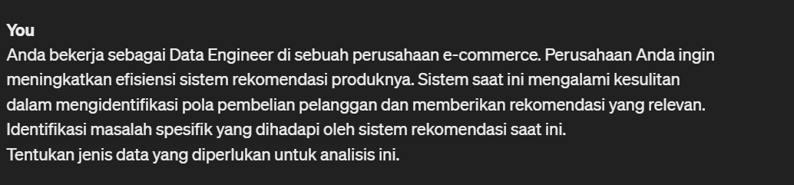
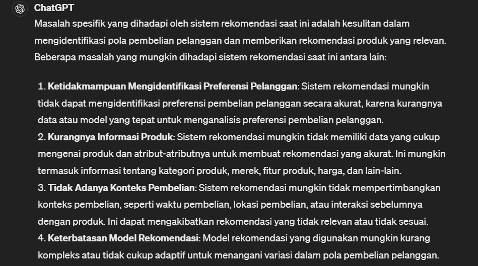
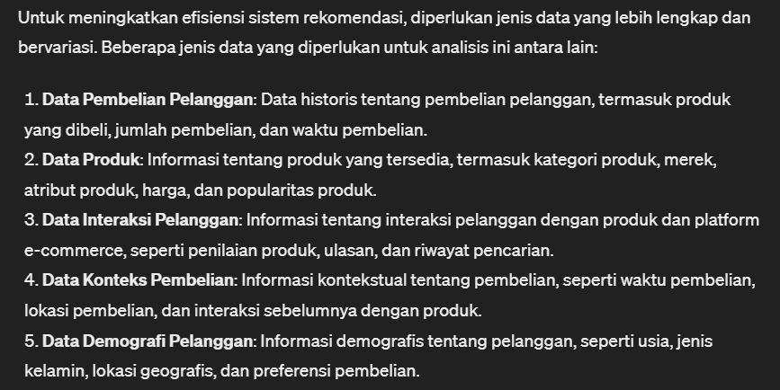

2. Penggunaan OpenAI Playground (boleh ChatGPT):
Gunakan OpenAI Playground untuk menghasilkan ide atau solusi untuk meningkatkan sistem rekomendasi.
Masukkan data contoh (misalnya, data transaksi pelanggan) dan eksplorasi potensi solusi menggunakan AI.

Jawaban:

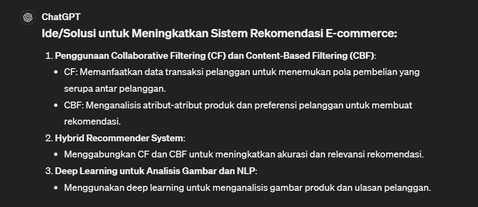
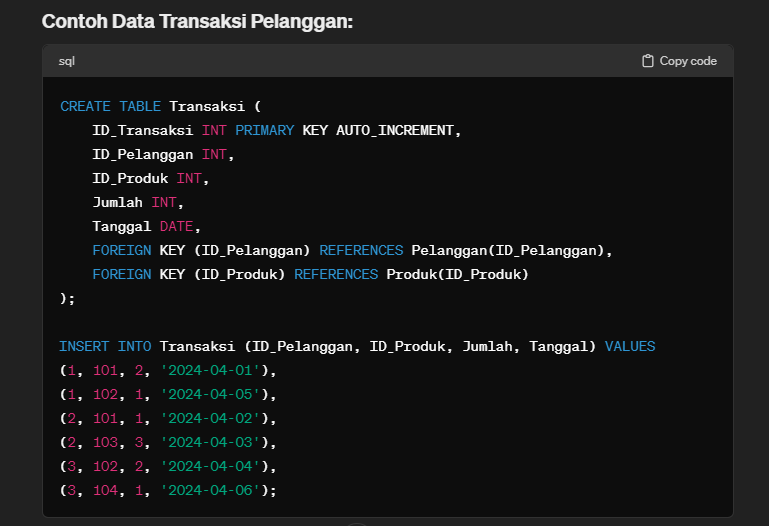
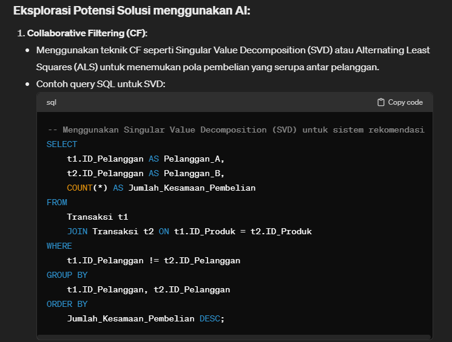
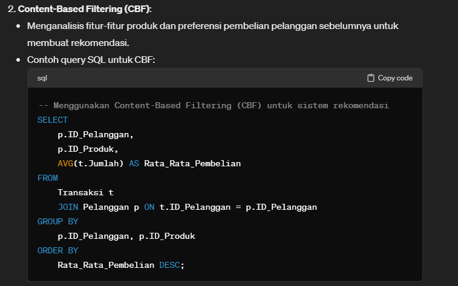
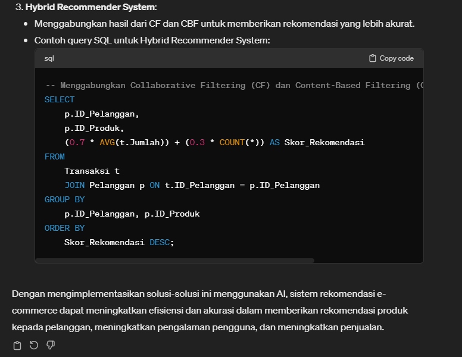

3. Evaluasi Solusi:
Analisis solusi yang dihasilkan oleh AI.
Tentukan bagaimana solusi ini dapat diintegrasikan ke dalam sistem rekomendasi yang ada.

Jawaban:

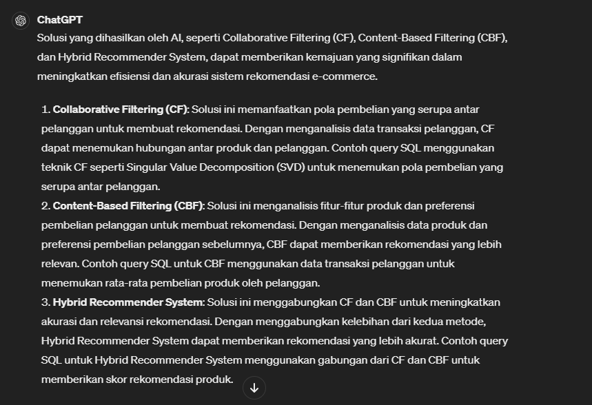
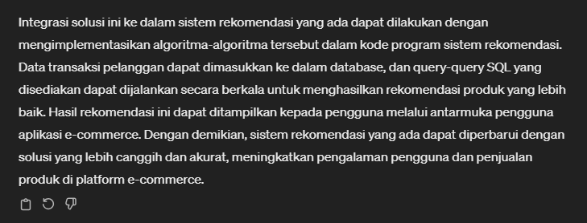

4. Dokumentasi dan Presentasi:
Dokumentasikan proses analisis, termasuk input dan output dari OpenAI Playground (ChatGPT).
Buat laporan atau presentasi yang menjelaskan bagaimana AI dapat membantu meningkatkan sistem rekomendasi.

Jawaban:

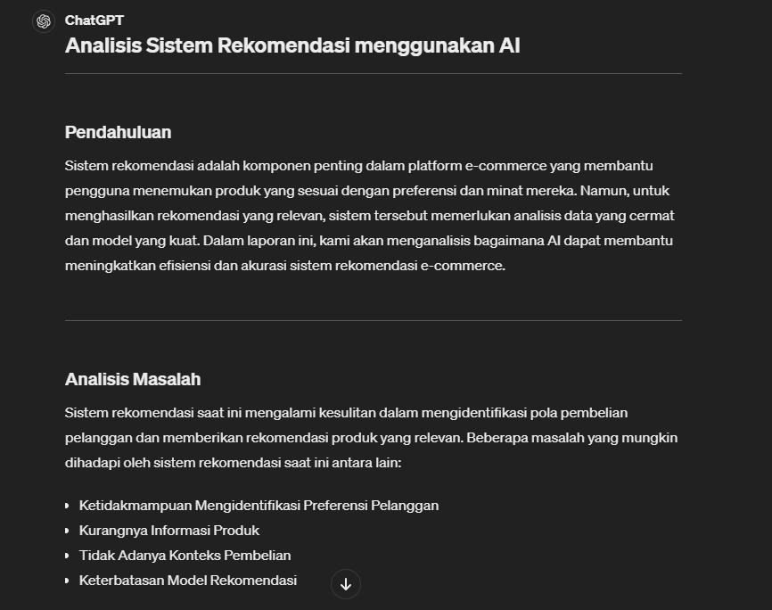
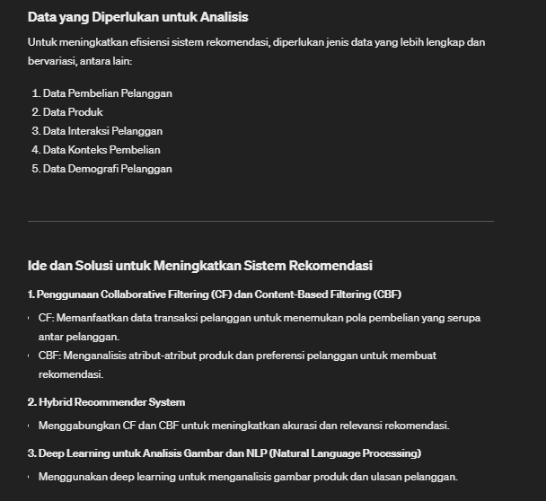
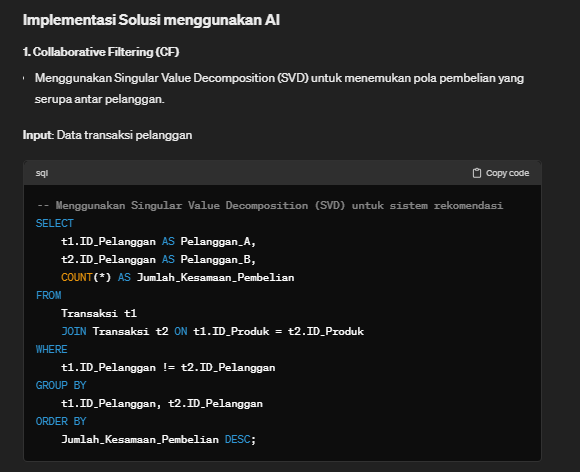
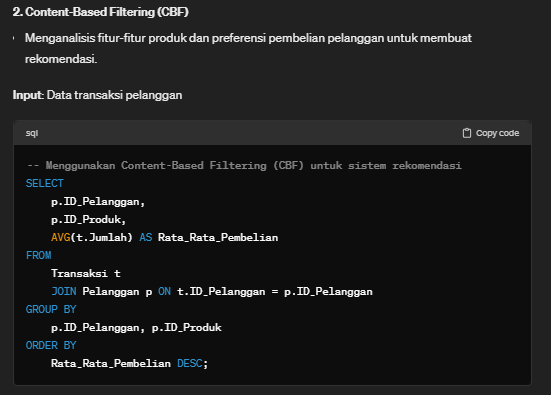

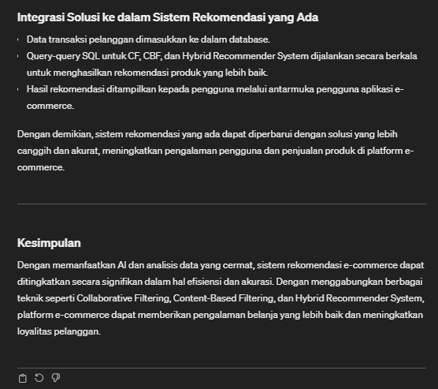