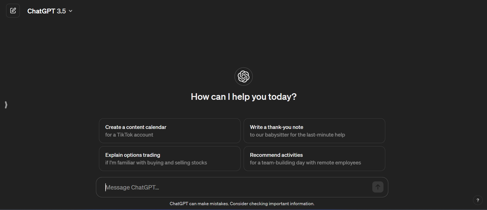
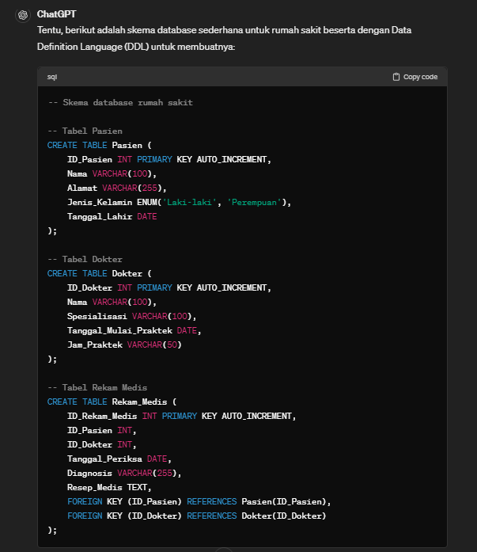
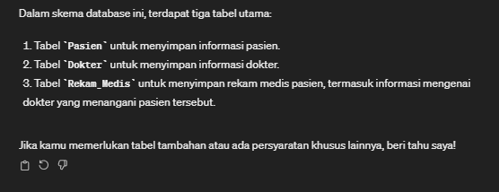

# Soal Jawaban Introduction AI on Data Engineer Prioritas 1

- Soal Prioritas 1 (Nilai 80)

1. Pengenalan OpenAI Playground:
Buka OpenAI Playground di platform.openai.com/examples (boleh ChatGPT).
Pilih salah satu template yang relevan dengan Data Engineering, misalnya "Data Analysis" atau "SQL Queries".

Jawaban:

2. Eksekusi dan Analisis:
Masukkan input yang berkaitan dengan analisis data atau query SQL.
Jalankan model AI dan amati output yang dihasilkan.

Jawaban:

3. Dokumentasi:
Ambil screenshot hasil eksekusi di OpenAI Playground (boleh ChatGPT).
Copy-paste input dan output ke dalam file txt.

Jawaban:

Screenshot terlampir pada file jawaban.md serta folder Screenshots

Input dan output terlampir pada file jawaban.txt

4. Penjelasan Hasil:
Buat penjelasan singkat mengenai bagaimana AI memproses input dan menghasilkan output.
Jelaskan potensi aplikasi hasil ini dalam konteks Data Engineering.

Jawaban:

Dalam contoh di atas, sistem AI menggunakan aturan sintaks SQL untuk memproses input yang diberikan, yaitu skema database rumah sakit, dan menghasilkan output berupa Data Definition Language (DDL) yang sesuai. Input yang diberikan adalah struktur skema database rumah sakit, yang mencakup tabel untuk pasien, dokter, dan rekam medis. AI menganalisis struktur yang diberikan dan menghasilkan perintah SQL CREATE TABLE untuk setiap tabel beserta dengan kolom-kolom yang diperlukan, serta menambahkan kunci-kunci asing (foreign keys) untuk menjaga integritas referensial antara tabel-tabel yang ada.

Potensi hasil di atas dalam konteks Data Engineering adalah bahwa DDL yang dihasilkan dapat digunakan untuk membuat skema database yang diperlukan untuk sistem informasi rumah sakit. DDL ini dapat dieksekusi pada sistem manajemen basis data (DBMS) seperti MySQL, PostgreSQL, atau yang lainnya untuk membuat struktur database yang diperlukan. Seorang data engineer dapat menggunakan DDL ini sebagai panduan untuk mengimplementasikan skema database yang diperlukan dalam proyek manajemen data rumah sakit. Selain itu, DDL ini juga dapat dimodifikasi atau diperluas sesuai dengan kebutuhan proyek, seperti penambahan tabel atau kolom-kolom tambahan untuk memenuhi persyaratan. Dengan demikian, hasil tersebut memberikan landasan yang kuat untuk mengelola data rumah sakit dengan efisien dan efektif.