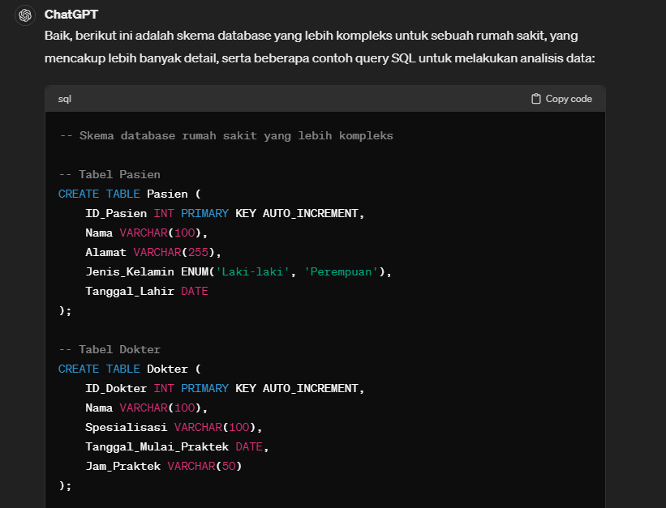
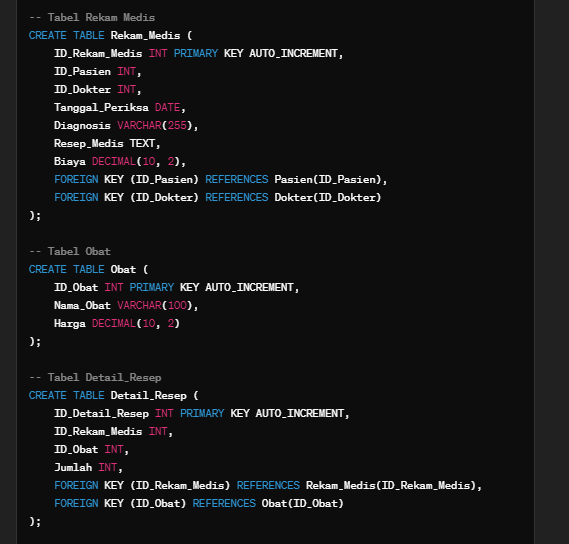
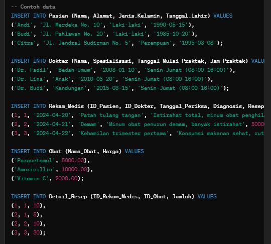
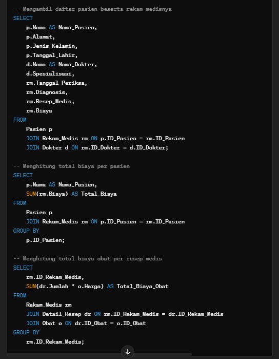
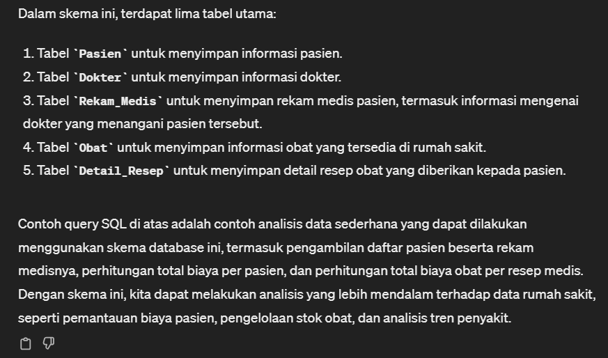

# Soal Jawaban Introduction AI on Data Engineer Prioritas 2

- Soal Prioritas 2 (Nilai 20)

1. Eksekusi Lanjutan:
Gunakan template yang lebih kompleks atau buat input yang lebih spesifik dan menantang, misalnya analisis data multivariat atau optimasi query SQL.

Jawaban:

2. Analisis Mendalam:
Analisis bagaimana AI memproses input yang lebih kompleks.
Identifikasi kelebihan dan keterbatasan AI dalam kasus ini.

Jawaban:

Dalam kasus skema database rumah sakit yang lebih kompleks seperti di atas, AI akan memproses input dengan menggunakan aturan-aturan sintaks SQL yang telah dipelajari dari data yang tersedia. AI akan menganalisis struktur skema database yang diberikan, termasuk tabel-tabel yang terlibat, hubungan antar tabel, dan struktur kolom. Selanjutnya, AI akan menggunakan pengetahuannya untuk menghasilkan output berupa perintah SQL yang sesuai, termasuk pembuatan tabel-tabel, definisi kolom, kunci asing, dan contoh data.

Kelebihan AI dalam kasus ini adalah kemampuannya untuk secara otomatis menganalisis struktur skema database yang kompleks dan menghasilkan perintah SQL yang sesuai dengan kebutuhan. AI dapat menghasilkan DDL (Data Definition Language) yang kompleks dengan cepat dan efisien, mengurangi waktu dan upaya yang dibutuhkan untuk membuat skema database yang kompleks.

Namun, ada beberapa keterbatasan yang perlu diperhatikan seperti:
Keterbatasan Pengetahuan: AI hanya dapat menghasilkan output berdasarkan pengetahuan yang telah dipelajarinya dari data yang ada. Jika ada elemen dalam skema database yang tidak dikenali oleh AI, atau jika ada aturan bisnis khusus yang harus diterapkan, AI mungkin tidak akan menghasilkan output yang sesuai.
Keterbatasan Analisis Konteks: Meskipun AI dapat menghasilkan perintah SQL yang valid, ia mungkin tidak selalu memahami konteks di balik data atau kebutuhan analisis data yang lebih mendalam. Misalnya, AI mungkin tidak dapat mengenali potensi masalah kinerja atau optimasi query yang diperlukan.
Ketergantungan pada Data Training: Kualitas output AI bergantung pada kualitas data pelatihan yang digunakan. Jika data pelatihan tidak representatif atau tidak lengkap, output AI mungkin tidak optimal.

3. Dokumentasi dan Penjelasan:
Ambil screenshot hasil eksekusi lanjutan.
Copy-paste input dan output ke dalam file txt.
Buat penjelasan mendalam tentang hasil dan implikasinya dalam Data Engineering.

Jawaban:

Screenshot terlampir pada file jawaban.md serta folder Screenshots
Input dan output terlampir pada file jawaban.txt

Hasil dari skema database rumah sakit yang lebih kompleks ini menawarkan struktur data yang lebih rinci dan detail, mencakup tabel-tabel untuk pasien, dokter, rekam medis, obat, serta detail resep obat. DDL yang dihasilkan oleh AI memungkinkan pembuatan skema database yang lengkap dan siap digunakan untuk menyimpan data rumah sakit dengan lebih efisien.

Implikasi dari hasil ini dalam Data Engineering sangat signifikan. Pertama, skema database yang lengkap dan rinci memungkinkan pengelolaan data rumah sakit secara efisien, termasuk pengelolaan informasi pasien, rekam medis, informasi dokter, dan informasi obat. Dengan struktur data yang terdefinisi dengan baik, pengembang perangkat lunak dapat dengan mudah mengakses dan memanipulasi data untuk membangun aplikasi rumah sakit yang lebih kompleks dan berfungsi.

Kedua, dengan skema database yang lebih lengkap, Data Engineer dapat melakukan analisis data yang lebih mendalam untuk mendapatkan wawasan yang berharga. Misalnya, dengan menggunakan contoh query SQL yang disediakan, Data Engineer dapat melakukan analisis biaya per pasien, mengidentifikasi pola penyakit yang umum, mengelola stok obat, serta menganalisis tren penggunaan obat dan biaya pengobatan.