# Soal Jawaban Implementation AI On Data Engineer

# Soal Prioritas 1 (Nilai 80)

1. Set Environment dan Dataset:

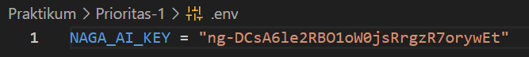

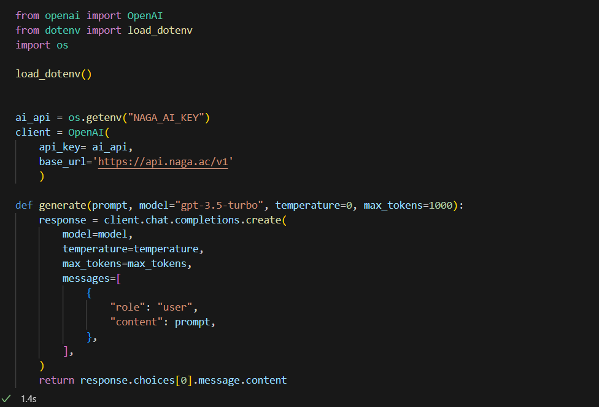

Siapkan dataset penjualan dalam format CSV atau Excel.

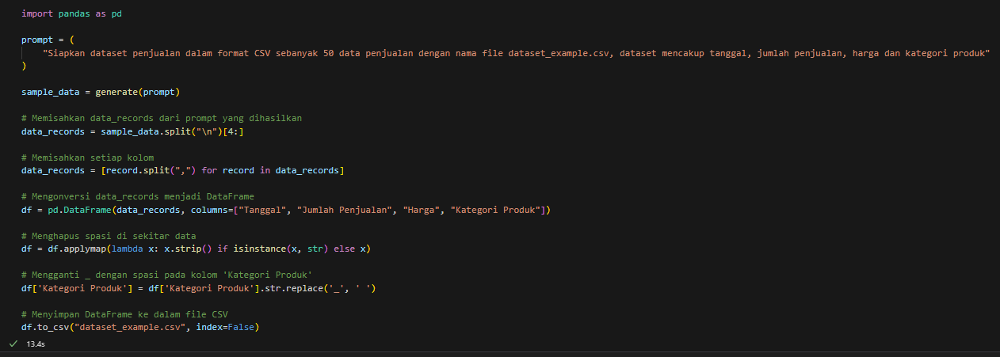

Dataset harus mencakup informasi penting seperti tanggal, jumlah penjualan, harga, kategori produk, dan lainnya.

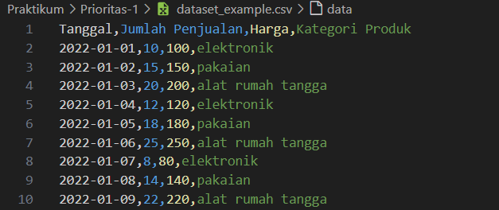

Buat file .env untuk menyimpan kredensial API OpenAI (misalnya, OPENAI_API_KEY).

2. Integrasi OpenAI API:

Gunakan Python untuk membaca kredensial dari file .env.

Integrasikan OpenAI API dengan skrip Python Anda untuk menganalisis dataset penjualan.

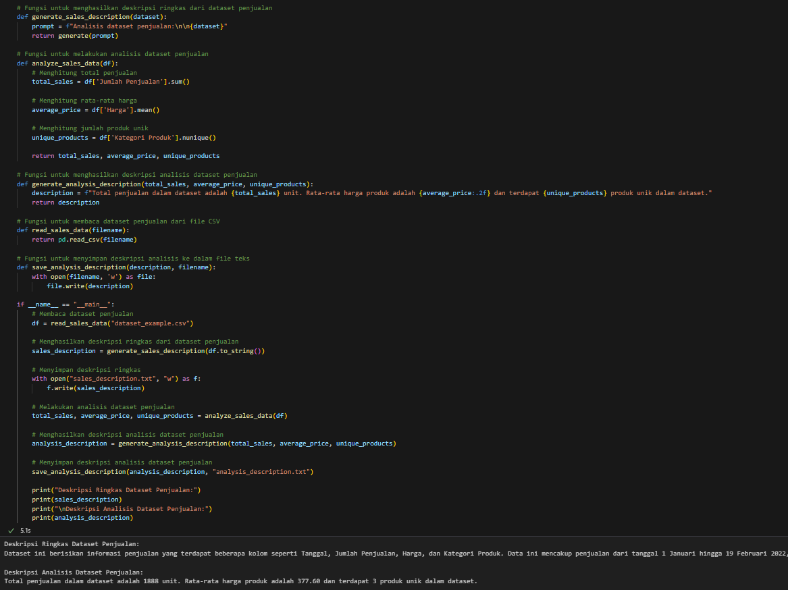

3. Optimasi Prompt Engineering:

Kembangkan berbagai prompt yang dirancang untuk mendapatkan insight dari dataset penjualan menggunakan OpenAI API.

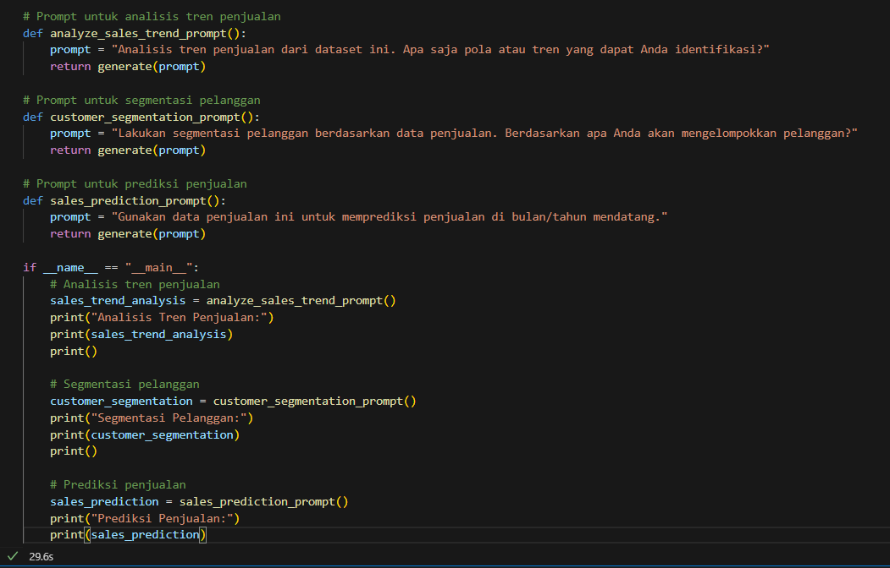

Fokuskan pada analisis tren penjualan, segmentasi pelanggan, dan prediksi penjualan.

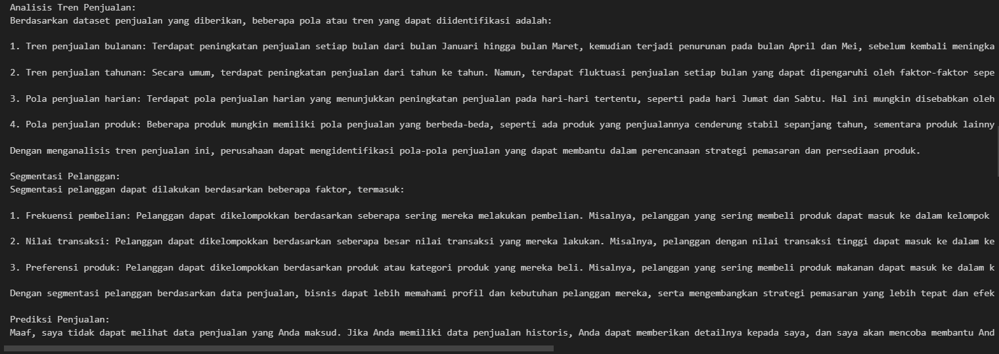

4. Analisis dan Visualisasi Data:

Gunakan Pandas untuk analisis data awal dan visualisasi menggunakan Matplotlib atau Seaborn.

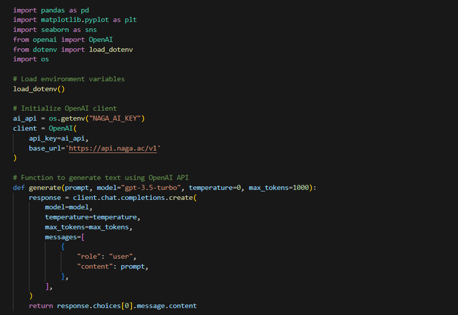

Bandingkan hasil analisis tradisional dengan insight yang diperoleh dari OpenAI API.

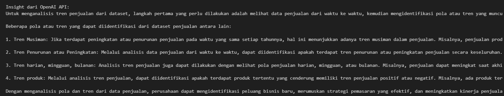

5. Dokumentasi Proses:

Dokumentasikan setiap langkah, mulai dari pengaturan lingkungan, pengolahan data, hingga analisis akhir.

Terlampir

Catat bagaimana penggunaan file .env dan OpenAI API mempengaruhi proses dan hasil analisis.

Hasil Analisis:

Analisis data awal dan visualisasi memberikan informasi tentang distribusi penjualan dan pola penjualan berdasarkan kategori produk.

OpenAI API digunakan untuk mendapatkan insight tambahan berdasarkan prompt yang dibuat.

Perbandingan hasil analisis tradisional dengan insight yang diperoleh dari OpenAI API memberikan gambaran yang lebih lengkap tentang dataset penjualan.

# Soal Prioritas 2 (Nilai 20)

Sebuah perusahaan retail ingin mengoptimalkan proses analisis data penjualan mereka. Mereka memiliki dataset penjualan yang mencakup informasi seperti tanggal transaksi, jumlah penjualan, harga, kategori produk, dan lainnya. Tujuan utama adalah untuk menghasilkan SQL queries yang dapat membantu dalam analisis data yang lebih efisien dan efektif.

1. Membuat Database

Buatkan tabel dengan atribut kurang lebih memiliki tanggal transaksi, jumlah penjualan, harga, kategori produk, dan lainnya
Generate SQL dengan OpenAI API:

Gunakan OpenAI API untuk menghasilkan SQL queries. Misalnya, berikan prompt seperti "Buatkan SQL query untuk menghitung total penjualan per kategori produk setiap bulan."

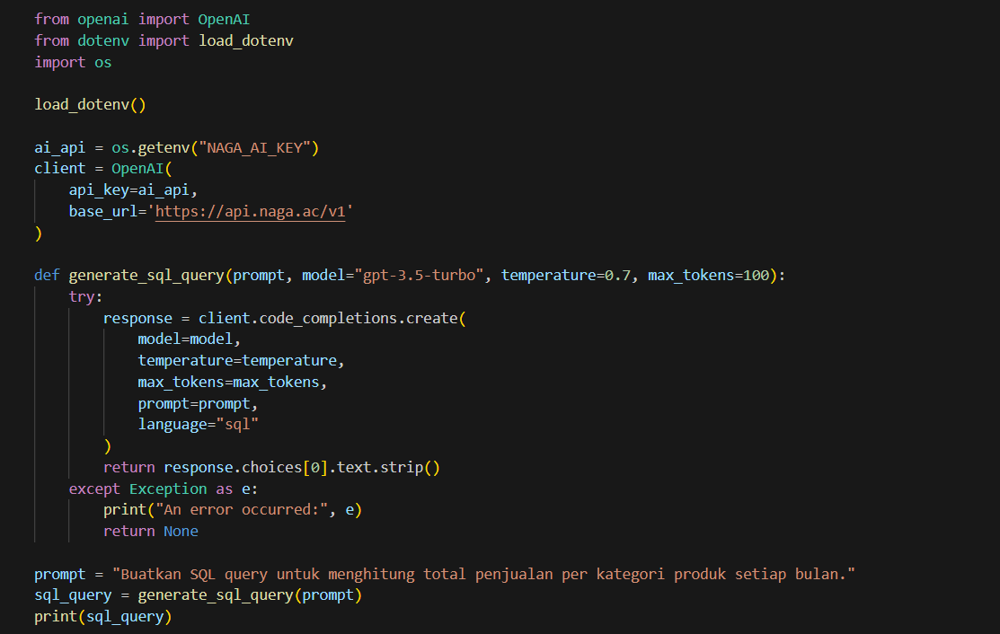

Catat respons AI dan analisis keakuratan serta relevansi query yang dihasilkan.

2. Validasi Query SQL

Validasi SQL queries yang dihasilkan menggunakan sistem manajemen database yang ada. Pastikan query berjalan dengan benar dan menghasilkan output yang diharapkan.

3. Implementasi dan Analisis Hasil:

Terapkan SQL queries yang telah divalidasi dan dioptimalkan dalam sistem database perusahaan.

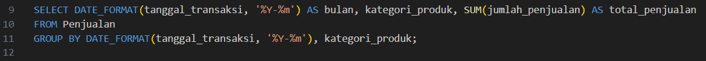

# Soal Eksplorasi (Nilai 20)

1. Studi Kasus Bisnis:

Pilih sebuah perusahaan atau bisnis nyata sebagai studi kasus. Kumpulkan data penjualan atau data relevan lainnya dari bisnis tersebut.

Gunakan OpenAI API untuk menganalisis data dan memberikan rekomendasi yang dapat membantu dalam pengambilan keputusan bisnis.

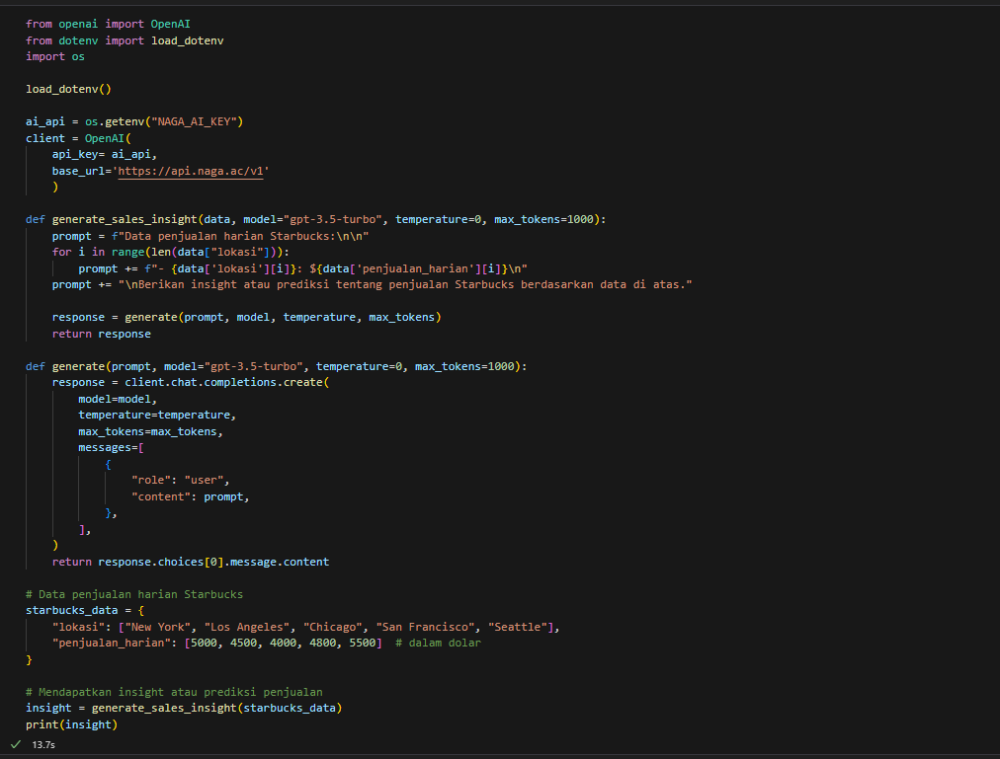

2. Implementasi Strategi Berbasis AI:

Berdasarkan analisis, buat rencana implementasi strategi yang didorong oleh AI untuk meningkatkan penjualan atau efisiensi operasional.

Meningkatkan Penjualan:

Prediksi Permintaan Produk

Personalisasi Penawaran

Pengoptimalan Harga Dinamis

Efisiensi Operasional:

Prediksi Kebutuhan Persediaan

Optimalisasi Rute Pengiriman

Prediksi Kebutuhan Tenaga Kerja

Eksplorasi bagaimana AI dapat digunakan untuk meningkatkan kepuasan pelanggan dan loyalitas.

Rekomendasi Produk yang Dipersonalisasi

Pelayanan Pelanggan yang Lebih Responsif

Penawaran Khusus untuk Pelanggan Setia
